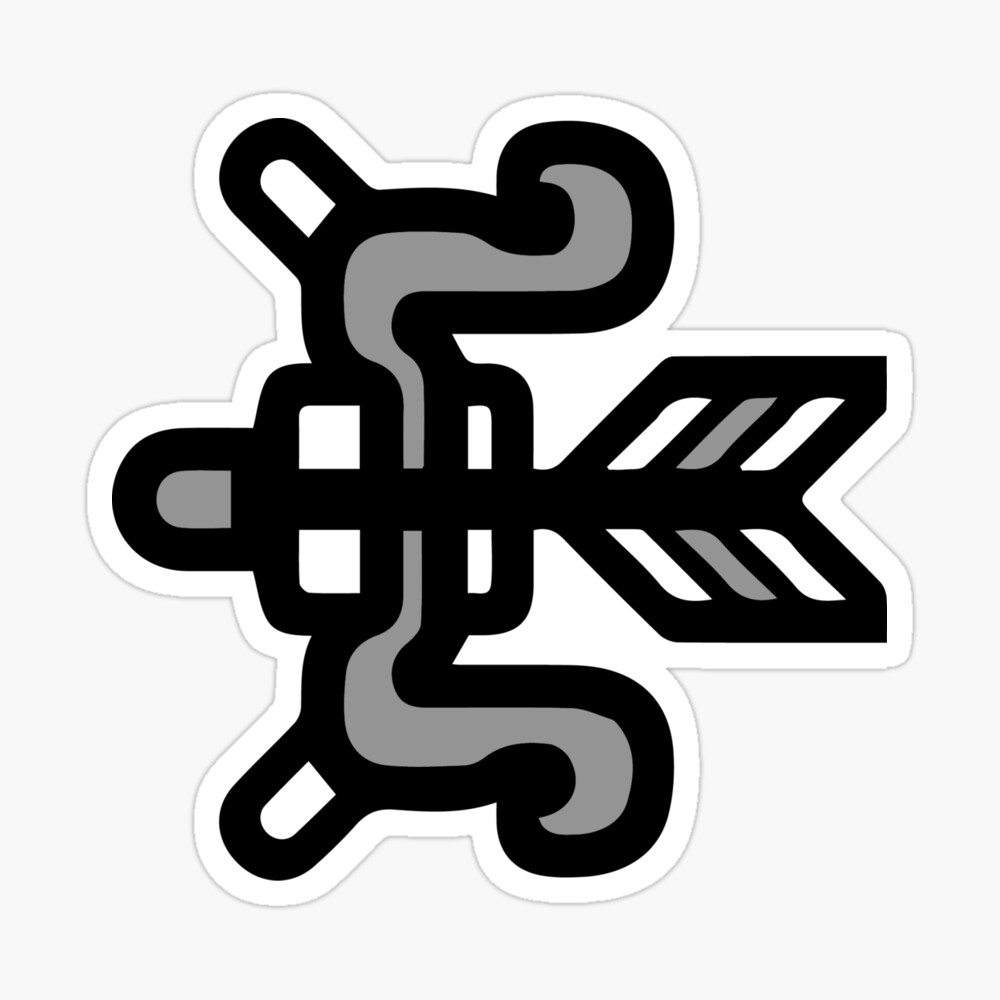

<link rel="stylesheet" href="../../base.css">

# Arco

Arma a distancia que se beneficia de su alcance para acertar daño perforante y usar revestimientos de flechas para ocasionar estados alterados.



## Estadísticas

- <span style="color:var(--ataque)">1d8</span> de daño ***Perforante*** + Modificador de <span style="color:var(--fuerza)">Fuerza</span> o <span style="color:var(--destreza)">Destreza</span>
- Alcance de 15-60 metros
- A 2 manos
- Ligero

## Competencia de Revestimiento

Tu arma tiene la capacidad de aplicar revestimientos que potencian tus flechas,
para ciertos revestimientos se aplica un calculo especial llamado **Competencia de Revestimiento** o **CR** para abreviar, dicho calculo se hace asi:

```CR = 8 + Bonus de Competencia + Modificador de Fuerza o Destreza```

## Habilidades

### Revestimientos

Como una acción bonus, puedes revestir hasta 10 flechas con un aceite especial para agregarles efectos. El aceite dura 10 minutos antes de evaporarse. Debes tener el aceite en tu bolsa de objetos para poder aplicarlo, solo puedes tener 10 unidades de aceites en tu bolsa de objetos.

### <span style="color:var(--poco-comun)">Revestimiento de Poder</span>

Obtienes +1 en tiradas de ataque y <span style='color:var(--ataque)'>+2</span> bonus en daño.


### <span style="color:var(--raro)">Perfora dragones</span>

``` Condiciones: 1 uso entre descansos largos ```

Como una acción, disparas un perfora dragones, golpeando todas las criaturas en una linea de 6 metros de largo y 1 metro de ancho. Cada criatura debe realizar una tirada de <span style='color:var(--destreza)'>destreza</span> y debe superar tu **CR**.

- Si Falla, recibe <span style='color:var(--ataque)'>3d6</span> de daño perforante.

- Caso contrario, recibe la mitad del daño.

Si la criatura es grande o gigante, recibe el doble de daño.

### <span style='color:var(--raro)'>Revestimiento de Quemarropa</span>

Ignoras cualquier desventaja al atacar una criatura que puedes ver, que este a 5 metros de tí. 

Tiene desventaja en ataques a criaturas que esten a más de 5 metros de tí.

### <span style='color:var(--raro)'>Revestimiento de Veneno</span>

Una criatura golpeada con esta flecha debe realizar una <span style='color:var(--constitucion)'>tirada de constitución</span> y superar tu CR, si no, será envenenado hasta el final de su siguiente turno.

### <span style='color:var(--raro)'>Revestimiento de Poder +2</span>

Obtienes +2 en tiradas de ataque y <span style='color:var(--ataque)'>+3</span> bonus en daño.

### <span style='color:var(--muy-raro)'>Mejora del perfora dragones</span>

Ahora el <span style='color:var(--raro)'>Perfora Dragones</span> hace <span style='color:var(--ataque)'>4d6</span> de daño perforante.

### <span style='color:var(--muy-raro)'>Revestimiento de Parálisis</span>

Una criatura golpeada con esta flecha debe realizar una <span style='color:var(--constitucion)'>tirada de constitución</span> y superar tu CR, si no, será paralizado durante 1 minuto.

La criatura puede repetir la tirada al final de cada uno de sus turnos, al superar, termina el efecto.

Una criatura que haya superado una tirada contra este
revestimiento sera inmune a sus efectos por 10 min.

### <span style='color:var(--muy-raro)'>Revestimiento de Poder +3</span>

Obtienes +2 en tiradas de ataque y <span style='color:var(--ataque)'>+4</span> bonus en daño, pero cada aceite solo afecta a 5 de tus flechas al mismo tiempo.

### <span style='color:var(--muy-raro)'>Revestimiento de Sueño</span>

Una criatura golpeada con esta flecha debe realizar una <span style='color:var(--constitucion)'>tirada de constitución</span> y superar tu CR, si no, será incapacitado por 1d4 rondas.

Si la criatura falla la tirada con una diferencia de 5 o más, caerá inconciente por 1 minuto hasta que reciba daño o sea despertado.

Una criatura que haya superado una tirada contra este revestimiento o haya sido despertado, sera inmune a sus efectos por 10 min.

### <span style='color:var(--legendario)'>Mejora del Perfora dragones +2</span>

Ahora haces <span style='color:var(--ataque)'>6d6</span> de daño perforante.

### <span style='color:var(--legendario)'>Revestimiento de Nitro</span>

Una criatura golpeada con esta flecha recibe un daño adicional de <span style='color:var(--ataque)'>1d6</span> de <span style='color:var(--fuego)'>daño fuego</span> y cada criatura en un radio de 1 metro recibe la mitad del daño.

## Efectos de la rareza del arma

- <span style='color:var(--poco-comun)'>Poco común</span> y <span style='color:var(--raro)'>Raro</span>: <span style='color:var(--ataque)'>+1</span> en tiradas de ataque y daño.

- <span style='color:var(--muy-raro)'>Muy Raro</span>: <span style='color:var(--ataque)'>+2</span> en tiradas de ataque y daño.

- <span style='color:var(--legendario)'>Legendario</span>: <span style='color:var(--ataque)'>+3</span> en tiradas de ataque y daño.

