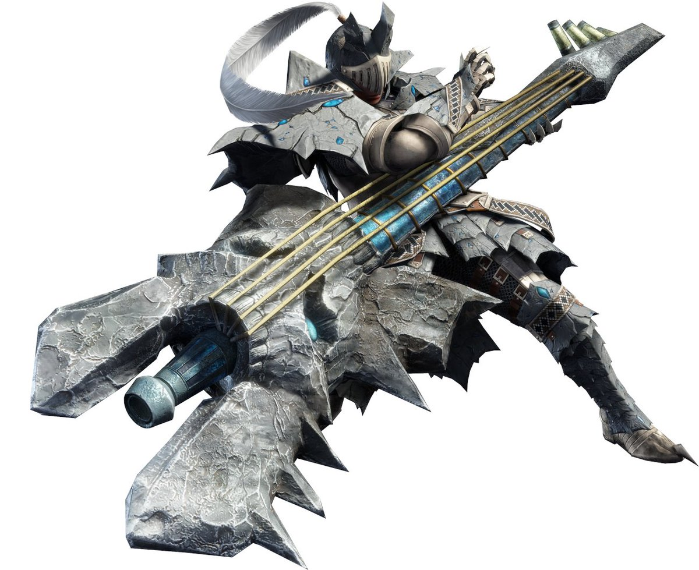

<link rel="stylesheet" href="../../base.css">

# Cornamusa

Arma curiosa, utiliza extrañas melodias que afectan a los aliados y brinda efectos beneficiosos y muy potentes. Pero aunque te quedes sin aliento, no te quedas sin opciones porque puedes golpear con el arma y realizar buen daño

## Estadísticas

- 1d12 de daño Contundente + tu modificador de Fuerza, Constitución o Carisma
- Pesada
- A 2 manos

### Acordes: 2 máximo

## Habilidades

### Melodía

Cuando golpeas con esta arma, puedes obtener un número de notas, igual a la cantidad de acordes del arma.

Notas con el mismo nombre, como Ataque (P) y Ataque (M), no pueden usarse en la
misma melodía.

Las notas pueden ser almacenadas por 1 minuto o hasta que se completa una melodía. Como una acción, puedes completar la melodía, proveyendo los beneficios de las notas que componen la melodía a tí y todas las criaturas aliadas que esten a un rango de 15 metros de ti y que sean capaces de escucharte.

La melodía es efectiva por 1 minuto, hasta que completes una nueva melodía, seas noqueado, o utilices una acción bonus para terminar la melodía actual.

### Melodía Mono-nota

Como una acción puedes golpear tu cornamusa en el suelo para activar una melodía mono-nota.

Cuando lo haces, tu y todos los aliados que esten a un rango de 15 metros de ti, obtienen el beneficio de la nota que elegiste por hasta el final de su siguiente turno.

## Notas Disponibles

### Ataque (P)

+1 de bonus al daño contundente, cortante y perforante.

### Movimiento (P)

+1 metro bonus a la velocidad de movimiento.

### Habilidad (P)

+1 de daño bonus a cualquier habilidad que eliga el objetivo de la melodia.

### Defensa (P)

+1 de AC Bonus natural.

### Ataque Elemental (P)

+2 de bonus al daño elemental.

### Estados Alterados (P)

+2 de bonus a la tirada que debe superar la criatura que recibe un ataque del objetivo de esta melodia.

### Ataque (M)

+2 de bonus al daño contundente, cortante y perforante.

### Tapones

Todas las criaturas aliadas que escuchen tu melodía recibiran protección ante sonidos fuertes y potentes.

### Temple

Todas las criaturas aliadas que escuchen tu melodía no reciben daño del frio o calor extremo.

### Defensa (G)

+2 de AC Bonus natural.

### Movimiento (G)

+2 metros bonus a la velocidad de movimiento.

### Tiradas

Todas las criaturas aliadas que escuchen tu melodía reciben +2 de bonus en todas su tiradas de salvación.

### Habilidad (G)

+2 de daño bonus a cualquier habilidad que eliga el objetivo de la melodia.

### Afinidad (P)

+1 de ventaja en críticos.

### Afinidad (G)

+2 de ventaja en críticos.

### Resistencia al Encanto

Todas las criaturas aliadas que escuchen tu melodía reciben ventaja en tiradas de carisma, intimidación o de miedo.

### Ataque (G)

+3 de bonus al daño contundente, cortante y perforante.

### Salvación

+3 de bonus a las tiradas de ***salvación de muerte***.

### Ataque Elemental (G)

+4 de bonus al daño elemental.

### Resistencia a Estados Alterados

Todas las criaturas aliadas que escuchen tu melodía reciben ventaja en tiradas de parálisis, veneno, aturdimiento o sueño.

Tu eliges sobre cual estado dar la ventaja, puedes repetir esta nota 1 vez por cada estado alterado en una misma melodía.

## Efectos de la rareza del arma

- Poco común: +1 acorde extra.

- Raro: +2 acordes extra.

- Muy Raro: +3 acordes extra. +1 en tiradas de ataque y daño.

- Legendario: +4 acordes extra. +2 en tiradas de ataque y daño.

