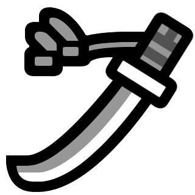
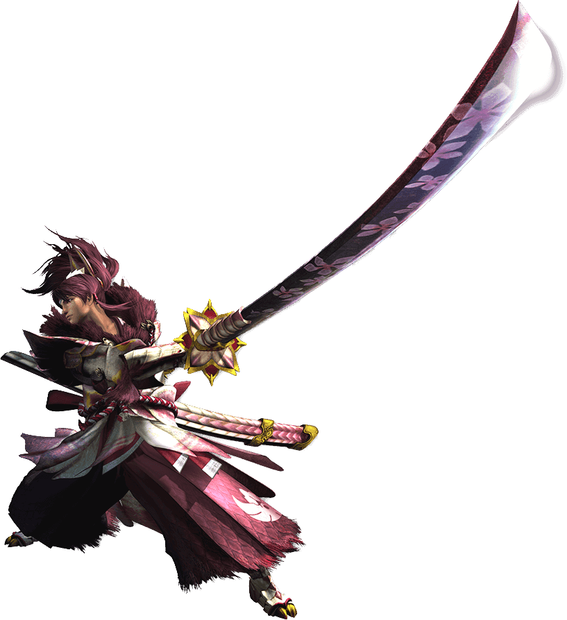

<link rel="stylesheet" href="../../base.css">

# Espada Larga

Arma que se caracteriza por el gran daño que puede llegar a inflingir gracias a su habilidad Medidor Espiritual



## Estadísticas

- <span style="color:var(--ataque)">1d10</span> de daño ***Cortante*** + Modificador de <span style="color:var(--fuerza)">Fuerza</span> o <span style="color:var(--destreza)">Destreza</span>
- Ligero

## Habilidades

### <span style="color:var(--poco-comun)">Medidor Espiritual</span>

Después de golpear una criatura con esta arma, obtienes 1 nivel espiritual hasta un máximo de 6.

Pierdes todos tus niveles si te noquean o dejas de atacar por mas de 1 minuto.

### <span style="color:var(--poco-comun)">Hoja Espiritual</span>

Cuando golpeas una criatura con esta arma, puedes consumir cualquier número de niveles, realizas <span style='color:var(--ataque)'>+1</span> como daño extra por cada nivel consumido.

### <span style="color:var(--raro)">Corte Espiritual</span>

Cuando una criatura falla un ataque contra ti, puedes consumir 3 niveles para realizar un ataque con ventaja contra el atacante.

### <span style='color:var(--muy-raro)'>Mejora del Medidor Espiritual</span>

Ahora obtienes 2 niveles espirituales después de golpear una criatura.

### <span style='color:var(--muy-raro)'>Mejora de Hoja Espiritual</span>

Ahora obtienes <span style='color:var(--ataque)'>+2</span> como daño extra por cada nivel.

### <span style='color:var(--muy-raro)'>Estocada Espiritual</span>

Si una criatura que puedes ver se encuentra a la mitad de tu <span style='color:var(--velocidad)'>velocidad de movimiento</span>, puedes consumir 3 niveles para moverte en linea recta a una casilla vacía a 1 metro de distancia de la criatura, este movimiento no provoca ataques de oportunidad. Terminas el movimiento realizando un intento de ataque en estocada, este ataque realiza el daño normal de tu arma pero el tipo de daño cambia a ***Perforante***. 

```Esta habilidad no se cuenta como un ataque sino como una acción de movimiento.```

### <span style='color:var(--muy-raro)'>Tajo Circular Espiritual</span>

Inmediatamente después de que haces tu acción de ataque, puedes consumir 5 niveles para realizar un ataque circular en un radio de 1 metro y atacar a todas las criaturas que se encuentren en el radio.

También puedes decidir no hacer este ataque circular, en su lugar puedes hacer un ataque a una criatura que puedas ver que esté a 1 metro del objetivo de tu ataque inicial.

### <span style='color:var(--legendario)'>Mejora del Medidor Espiritual +2</span>

Ahora obtienes 3 niveles espirituales después de golpear una criatura.

### <span style='color:var(--legendario)'>Mejora de Hoja Espiritual</span>

Ahora obtienes <span style='color:var(--ataque)'>+3</span> como daño extra por cada nivel.

## Efectos de la rareza del arma

- <span style='color:var(--poco-comun)'>Poco común</span> y <span style='color:var(--raro)'>Raro</span>: <span style='color:var(--ataque)'>+1</span> en tiradas de ataque y daño.

- <span style='color:var(--muy-raro)'>Muy Raro</span>: <span style='color:var(--ataque)'>+2</span> en tiradas de ataque y daño.

- <span style='color:var(--legendario)'>Legendario</span>: <span style='color:var(--ataque)'>+3</span> en tiradas de ataque y daño.

