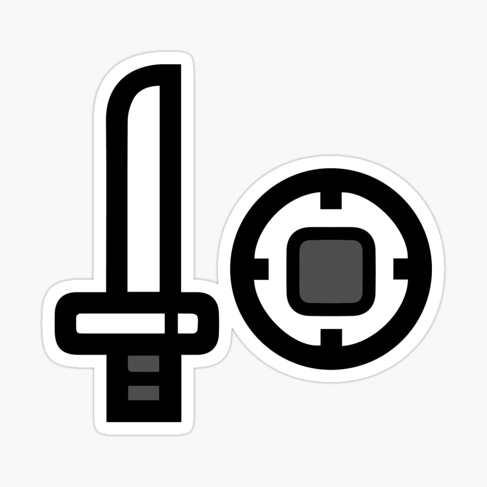
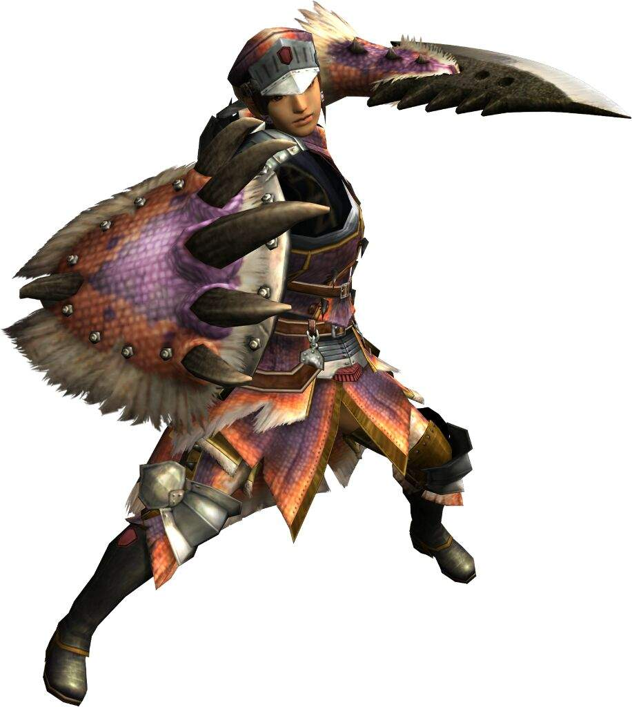

<link rel="stylesheet" href="../../base.css"/>
<link rel="stylesheet" href="https://raw.githubusercontent.com/ZadenOwer/D-D-Resources/main/base.css"/>

# Espada y Escudo

Esta arma se beneficia de ciertos aceites para aumentar sus capacidades ofensivas.



## Estadísticas

- <span style="color:var(--ataque)">1d6</span> de daño ***Cortante*** + Modificador de <span style="color:var(--fuerza)">Fuerza</span> o <span style="color:var(--destreza)">Destreza</span>
- +2 AC con el escudo levantado
- Ligero

## Habilidades

### <span style="color:var(--poco-comun)">Aceites</span>

El arma puede mantener 2 cargas de aceite.

Puedes cambiar el aceite equipado durante un descanso corto o un descanso largo, recuperas las cargas consumidas al final de un descanso corto o largo.

### <span style='color:var(--poco-comun)'>Manos libres</span>

Cuando haces esquivas o bloqueas exitosamente, como acción bonus puedes realizar la acción “usar un objeto”.

### <span style='color:var(--poco-comun)'>Bloqueo</span>

Como una reacción, obtienes +1 de AC contra un ataque melee o a distancia. Para ello, debes estar viendo al atacante mientras tienes desenfundada el arma.

Si la criatura atacante es grande o gigante, no puedes usar esta reacción.

### <span style='color:var(--poco-comun)'>Aceite de Afinidad</span>

Cuando realizas una acción de ataque con esta arma, y antes de realizar la tirada, puedes consumir 1 carga de aceite para reforzar tu arma y añadir <span style='color:var(--ataque)'>+1</span> a tu ventaja de criticos (se necesitaria un 19 y no un Nat 20 para alcanzar el critico) y <span style='color:var(--ataque)'>1d4</span> de daño extra si el ataque es exitoso.

Este efecto dura 30 segundos.

### <span style='color:var(--raro)'>Desgarrar (Pasiva)</span>

Una criatura golpeada por esta arma tiene desvantaja en sus tiradas de salvación por estados alterados ocasionados con este ataque.

### <span style='color:var(--raro)'>Mejora de Aceites</span>

Ahora puedes mantener hasta 4 cargas de aceites.

### <span style='color:var(--raro)'>Mazazo</span>

Cuando un ataque a melee lanzado a ti falla o lo bloqueas exitosamente, puedes utilizar tu reacción para realizar un golpe con tu escudo que realiza <span style='color:var(--ataque)'>1d8</span> de daño <span style='color:var(--contundente)'>contundente</span>.

### <span style='color:var(--raro)'>Aceite de Noqueo</span>

Cuando realizas una acción de ataque con esta arma, y antes de realizar la tirada, puedes consumir 2 cargas de aceite y dar el efecto de derribo a tu arma durante este ataque.

Al golpear, el objetivo debe superar una <span style='color:var(--constitucion)'>tirada de constitucion</span> de <span style='color:var(--ataque)'>8</span> + tu <span style='color:var(--competencia)'>modificador de competencia</span> + tu <span style='color:var(--fuerza)'>modificador de fuerza</span> o será derribado hasta el final de su siguiente turno.

### <span style='color:var(--muy-raro)'>Mejora de Manos Libres</span>

Ahora puedes realizar la acción “usar un objeto” como una acción bonus.

### <span style='color:var(--muy-raro)'>Mejora de Bloqueo</span>

Ahora puedes usar <span style='color:var(--poco-comun)'>Bloqueo</span> contra criaturas grandes. Obtienes +2 de AC contra criaturas grandes, medianas y pequeñas.

### <span style='color:var(--muy-raro)'>Mejora de Aceites +2</span>

Ahora puedes mantener hasta 6 cargas de aceites, ademas recuperas una carga de aceite al bloquear un ataque exitosamente con <span style='color:var(--poco-comun)'>Bloqueo</span>.

### <span style='color:var(--muy-raro)'>Mejora de Aceite de Afinidad</span>

Ahora obtienes <span style='color:var(--ataque)'>+2</span> en ventajas de criticos y ahora realiza <span style='color:var(--ataque)'>1d6</span> como daño extra.

### <span style='color:var(--muy-raro)'>Golpe en Salto</span>

Como acción de ataque, golpeas a una criatura realizando <span style='color:var(--ataque)'>2d6</span> de daño cortante, adicionalmente, si el golpe es exitoso, como acción bonus puedes hacer un salto de 5 pies de alto y al caer golpeas con el escudo, realizando <span style='color:var(--ataque)'>1d6</span> de daño <span style='color:var(--contundente)'>contundente</span>.

### <span style='color:var(--legendario)'>Mejora de Bloqueo +2</span>

Ahora puedes usar <span style='color:var(--poco-comun)'>Bloqueo</span> contra criaturas de cualquier tamaño. Obtienes +3 de AC contra criaturas grandes, medianas y pequeñas. Obtienes +2 de AC contra criaturas de categoria Gargantua.

### <span style='color:var(--legendario)'>Mejora de Aceites +3</span>

Ahora puedes mantener hasta 8 cargas de aceite y recuperas 2 cargas al bloquear exitosamente con <span style='color:var(--poco-comun)'>Bloqueo</span>

### <span style='color:var(--legendario)'>Mejora de Aceite de Afinidad +2</span>

Ahora obtienes <span style='color:var(--ataque)'>+3</span> en ventajas de criticos y usar el aceite te cuesta 2 cargas, y ahora realiza <span style='color:var(--ataque)'>2d6</span> como daño extra.

```Siempre puedes decidir usar el Aceite de Afinidad de menor rango si no tienes las cargas necesarias```

### <span style='color:var(--legendario)'>Mejora de Aceite de Noqueo</span>

Ahora el derribo tiene una duración de 1 minuto. La criatura puede repetir la tirada al final de cada uno de sus turnos, al superarla termina el efecto.

### <span style='color:var(--legendario)'>Tajo ascendente</span>

Como acción de ataque, adquieres una estancia de bloqueo por 1 turno, si eres objetivo de un ataque, adquieres +4 de AC, si el ataque falla, realizas un golpe con el escudo que realiza <span style='color:var(--ataque)'>3d6</span> de daño <span style='color:var(--contundente)'>contundente</span>, recuperas 4 cargas de aceite y te elevas en el aire.

Si no eres objetivo de ataque antes de tu siguiente turno, haras el salto en el aire como acción en tu siguiente turno.

Una vez en el aire, como acción bonus, puedes decidir descender con un ataque con el escudo realizando <span style='color:var(--ataque)'>1d6</span> de daño <span style='color:var(--contundente)'>contundente</span> o descender con un ataque normal con tu espada.

## Efectos de la rareza del arma

- <span style='color:var(--raro)'>Raro</span>: <span style='color:var(--ataque)'>+1</span> en tiradas de ataque y daño. <span style='color:var(--ataque)'>+1</span> extra de AC natural con el arma desenfundada

- <span style='color:var(--muy-raro)'>Muy Raro</span>: <span style='color:var(--ataque)'>+2</span> en tiradas de ataque y daño. <span style='color:var(--ataque)'>+2</span> extra de AC natural con el arma desenfundada

- <span style='color:var(--legendario)'>Legendario</span>: <span style='color:var(--ataque)'>+3</span> en tiradas de ataque y daño.

