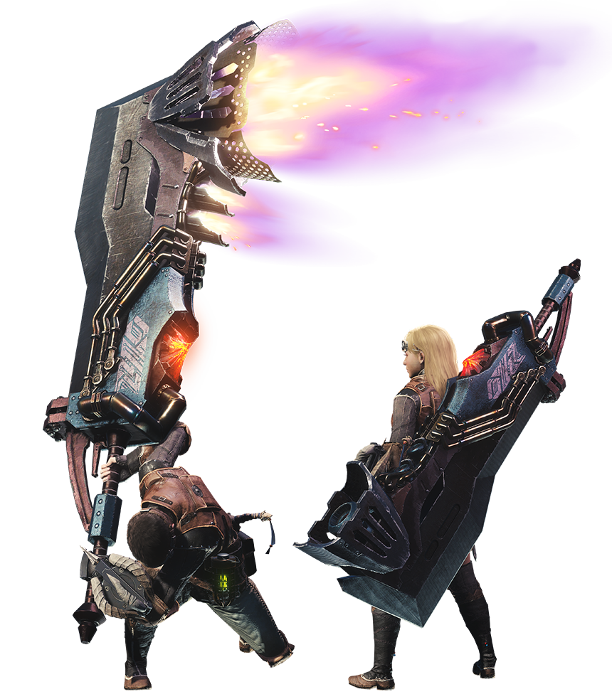

<link rel="stylesheet" href="../../base.css">

# Gran Espada

Una arma lenta pero poderosa, se caracteriza por evitar atacar para acumular mas daño y poder dar un golpe que podria aterrar a cualquier monstruo.

## Estadísticas

- 2d6 de daño ***Cortante*** + Modificador de Fuerza
- Pesada
- A 2 manos

## Habilidades

### Tajo Cargado

Como parte de un ataque, o una oportunidad de ataque, puedes no realizar el ataque para obtener una carga en el arma hasta un maximo de 3, las cargas se pierden si no se usan dentro de 1 minuto después desde la ultima carga o si se enfunda el arma.

Cuando haces una tirada de ataque mientras el arma tiene cargas, todas las cargas son consumidas y ese ataque tiene ventaja; puedes no obtener esta ventaja y todas las otras ventajas de este turno para obtener 1 carga extra (puedes exceder tu máximo) para consumir en este ataque.

Al golpear, el arma hace daño extra por cada carga equivalente a 1d6 + tu modificador de fuerza, además, recibes +3 de daño extra si 2 cargas fueron consumidas, y +6 de daño si fueron 3 cargas.

### Guardia

Como una reaccion, agregas +2 de AC contra un ataque melee que fuera a golpearte. Para esto debes estar viendo al atacante y tener desenfundada el arma. Tendrás desventaja en tiradas de salvación por ataques hasta tu siguiente turno.

### Tajo Amplio

Golpeas de manera horizontal con tu arma, atacando frente a ti en un cono de 1 metro, si tienes cargas, puedes consumir 1 carga y tener ventaja en este ataque. Si hay varias criaturas en el cono podrás consumir más cargas para obtener ventaja contra cada uno.

Este ataque puede usarse como una accion bonus después de realizar un ataque sin cargas.

### Mejora del Tajo Cargado

El daño por cada carga cambia a 1d8 + tu modificador de fuerza.

### Mejora de Guardia

Ahora obtienes +3 de AC cuando utilizas Guardia, si tienes cargas, no tendrás desventaja en tus tiradas de salvación.

### Mejora de Tajo Amplio

Ahora puedes usar este ataque como una acción bonus despues de realizar un Tajo Amplio.

### Mejora del Tajo Cargado +2

El daño por cada carga cambia a 1d10 + tu modificador de fuerza.

### Mejora de Guardia +2

Ahora recibiras 1 carga al bloquear exitosamente con Guardia.

### Mejora de Tajo Amplio +2

Ahora, si usas este ataque como acción bonus después de acertar con Tajo Amplio, harás daño extra por cada carga que fue usada equivalente a 1d6 + tu modificador de fuerza. 

Si el Tajo Amplio falló, no recibirás el daño extra por las cargas.

## Efectos de la rareza del arma

- Raro: +1 en tiradas de ataque y daño.

- Muy Raro: +2 en tiradas de ataque y daño.

- Legendario: +3 en tiradas de ataque y daño.

