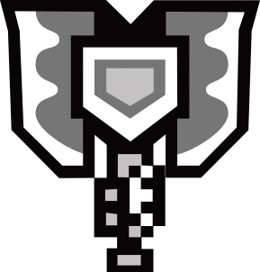
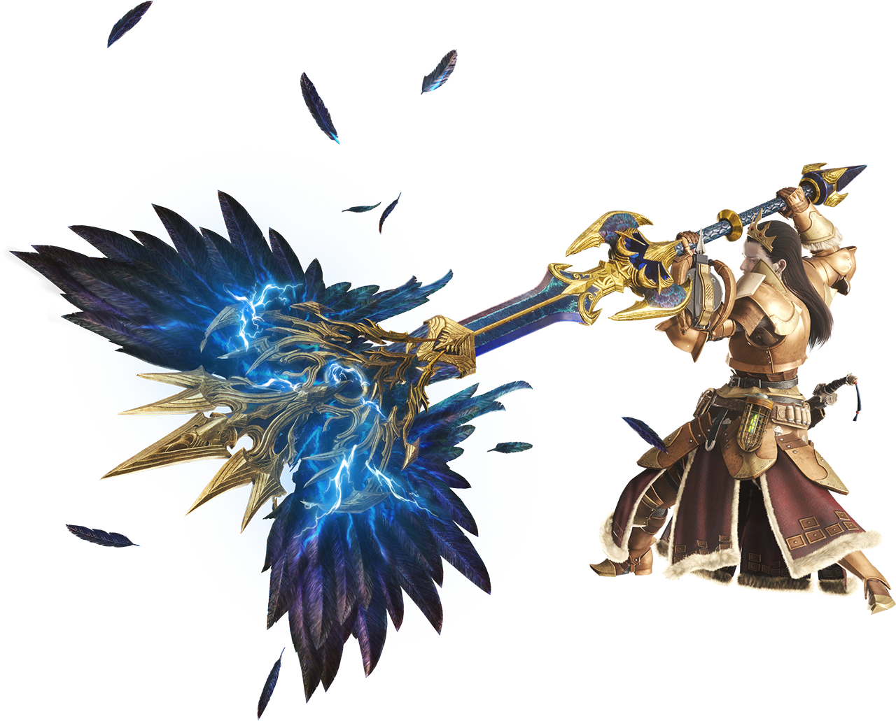

<link rel="stylesheet" href="../../base.css">

# Hacha Cargada

## Estadísticas

### Modo Hacha (H)

- 1d12 de daño ***Cortante*** + tu modificador de Fuerza
- Alcance de 2 metros
- Pesada
- A 2 manos

### Modo Espada y Escudo (E&E)

- 1d6 de daño ***Cortante*** + tu modificador de Fuerza
- +2 de AC natural con el arma desenfundada
- Ligero
- A 2 manos

## Habilidades

### Intercambio

Como una acción Bonus, puedes cambiar el arma entre **Modo Hacha** y **Modo Espada y Escudo**

Si tu arma no tiene elemento entonces las habilidades que hacen daño elemental pasan a considerarse daño contudente.

### Carga de Viales

Cuando golpeas una criatura con esta arma mientras estas en modo **E&E**, ganas 1 carga de vial hasta un máximo de 5.

Las cargas se mantienen hasta tu siguiente descanso corto o descanso largo.

### Guardia Elemental

Mientras estas en modo E&E, como una reacción, obtienes +2 de AC contra un ataque melee o a distancia. Para ello, debes estar viendo al atacante mientras tienes desenfundada el arma.

Si bloqueas exitosamente puedes consumir un vial y hacer 1d4 de daño a la criatura, el daño es elemental y depende del elemento de tu arma.

### Descarga Elemental

Mientras estas en modo H, como una acción bonus al golpear una criatura, puedes consumir 1 vial para hacer 1d6 de daño elemental extra.

### Descarga Elemental Amplificada

Mientras estas en modo H, como una acción puedes consumir cualquier cantidad de viales para liberar una onda de choque que inflige daño elemental en un cono hasta 5 metros enfrente de ti.

Cada criatura en esa área debe superar una tirada de destreza igual o mayor a 8 + tu modificador de competencia + tu estadistica de fuerza.

Si falla la tirada, el objetivo recibe 1d4 + tu modificador de competencia de daño elemental por cada vial consumido.

Si supera la tirada, el objetivo recibe la mitad del daño.

Puedes realizar esta acción un número de veces igual a tu modificador de competencia. Recuperas todos los usos al complentar un largo.

### Mejora de Guardia Elemental

Ahora haces 1d6 de daño elemental.

### Mejora de Descarga Elemental

Ahora haces 1d8 de daño elemental extra.

### Mejora de Descarga Elemental Amplificada

Ahora haces 1d6 de daño elemental por cada vial consumido.

Adicionalmente si una criatura ocupa todos los espacios del cono, recibe el doble daño.

### Mejora de Carga de Viales +2

Ahora al golpear una criatura ganas 2 cargas, adicionalmente puedes mantener hasta 8 cargas.

### Mejora de Descarga Elemental +2

Ahora haces 1d10 de daño elemental extra pero debes consumir 2 cargas. Si no tienes las cargas suficientes siempre puedes usar la habilidad de menor rango.

### Mejora de Descarga Elemental Amplificada +2

Ahora haces 1d8 de daño elemental por cada vial consumido.

## Efectos de la rareza del arma

- Poco común: +1 en tiradas de ataque y daño. +1 de AC natural con el arma desenfundada en modo E&E.

- Raro y Muy Raro: +2 en tiradas de ataque y daño. +2 de AC natural con el arma desenfundada en modo E&E.

- Legendario: +3 en tiradas de ataque y daño. +2 de AC natural con el arma desenfundada en modo E&E.

