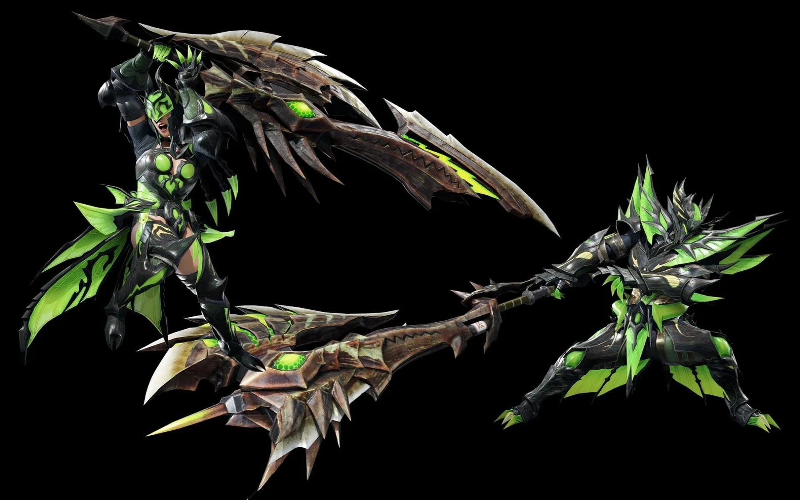

<link rel="stylesheet" href="../../base.css">

# Hacha Espada

Arma con un complejo mecanismo de mutación, se especializa en realizar daño mediante la utilización de viales, daño masivo asegurado.


## Estadísticas

### Modo Hacha

- <span style="color:var(--ataque)">1d10</span> de daño ***Cortante*** + <span style="color:var(--fuerza)">tu modificador de Fuerza</span>
- Pesada
- A 2 manos

### Modo Espada

- <span style="color:var(--ataque)">1d10</span> de daño ***Cortante*** + <span style="color:var(--fuerza)">tu modificador de Fuerza</span>
- Alcance de 2 metros
- Pesada
- A 2 manos

## Habilidades

### Intercambio

Como una acción Bonus, puedes cambiar el arma entre **Modo Hacha** y **Modo Espada**

### <span style='color:var(--poco-comun)'>Medidor de Espada</span>

Esta arma puede mantener hasta 20 cargas en el medidor de espada.

### <span style='color:var(--poco-comun)'>Viales</span>

Durante un descanso corto o largo puedes insertar viales dentro del medidor de espada, recuperas todas las cargas consumidas cuando finalizas un descanso corto o largo, adicionalmente, puedes consumir 10 min para cambiar tus
viales en cualquier momento, pero no recuperaras cargas ya consumidas.

Cuando atacas con esta arma en modo espada, antes de realizar la tirada de ataque, puedes consumir cualquier cantidad cargas igual al costo de viales del medidor de espada para aplicar los efectos de los viales en este ataque.

Al golpear una criatura con esta arma en modo hacha, recuperas 1 carga. Si ejecutas un critico, recuperas un número de cargas igual a <span style='color:var(--competencia)'>tu modificador de competencia</span>.

### <span style='color:var(--poco-comun)'>Vial de Poder</span>

```Costo: 2 cargas```

El dado utilizado para el calculo de daño de esta arma se convierte en <span style='color:var(--ataque)'>1d12</span>.

### <span style='color:var(--raro)'>Vial Elemental</span>

```Solo para armas que no sean de estados alterados```
```Costo: 3 cargas```

Realizas <span style='color:var(--ataque)'>1d4</span> de daño elemental extra al golpear una criatura.

Si tu arma no tiene elemento entonces el daño pasa a considerarse daño <span style='color:var(--contundente)'>contudente</span>.

### <span style='color:var(--raro)'>Vial de Estado Alterado</span>

```Solo para armas que sean de estados alterados```
```Costo: 3 cargas```

Si la criatura esta afectada por el estado alterado de tu arma después del ataque, recibira <span style='color:var(--ataque)'>2d4</span> de daño extra.

### <span style='color:var(--raro)'>Mejora del Vial de Poder</span>

```Costo: 4 cargas```

Además de los efectos del rango anterior, agregas <span style='color:var(--ataque)'>1d4</span> a tu tirada de ataque.

Puedes seguir utilizando el rango anterior.

### <span style='color:var(--muy-raro)'>Mejora del Medidor de Espada</span>

Ahora el medidor puede mantener hasta 40 cargas.

### <span style='color:var(--muy-raro)'>Mejora de Viales</span>

Ahora puedes insertar hasta 2 viales distintos en el medidor durante un descanso corto o largo, pero solo puedes usar 1 de ellos en cada ataque. Puedes consumir 10 min para cambiar los viales en cualquier momento, pero no recuperaras las cargas ya consumidas.

Los ataques en modo **Hacha** ahora recuperan 3 cargas.

### <span style='color:var(--muy-raro)'>Mejora del Vial Elemental</span>

```Costo: 5 cargas```

El daño cambia a <span style='color:var(--ataque)'>1d6</span> y el daño inflingido por tu arma se convierte puramente elemental.

### <span style='color:var(--muy-raro)'>Mejora del Vial de Estado Alterado</span>

```Costo: 6 cargas```

El daño extra aumenta a <span style='color:var(--ataque)'>4d4</span>

### <span style='color:var(--muy-raro)'>Descarga de Viales Comprimidos</span>

```Costo: 20 cargas```

Estando en modo **Espada**, te enganchas con un ataque al monstruo y empiezas a hacerle <span style='color:var(--ataque)'>1d6</span> al final del turno de cualquier criatura no inmobilizada. Si el monstruo se mueve o ataca a alguien mientras estas enganchado, debes hacer una tirada con ventaja de <span style='color:var(--fuerza)'>Fuerza</span> y superar 8 + <span style='color:var(--fuerza)'>el modificador de fuerza de la criatura</span> o perderas el enganche y serás lanzado recibiendo <span style='color:var(--ataque)'>1d6</span> como daño.

Al inicio de tu siguiente turno, o si realizas 4 ataques mientras estas enganchado, detonaras los viales comprimidos del arma y haras <span style='color:var(--ataque)'>8d6</span> + <span style='color:var(--competencia)'>tu modificador de competencia</span> + <span style='color:var(--ataque)'>tu modificador de daño</span> a la criatura.

Tu arma pasará a modo **Hacha** y no podras usar el modo **Espada** durante 1 min hasta que se enfríe o recuperes 20 viales.

### <span style='color:var(--legendario)'>Mejora del Medidor de Espada +2</span>

Ahora el medidor puede mantener hasta 50 cargas.

### <span style='color:var(--legendario)'>Mejora de Viales +2</span>

Ahora los ataques en modo **Hacha** recuperan 4 cargas.

Reduce el coste los viales en 1

### <span style='color:var(--legendario)'>Mejora de la Descarga de Viales Comprimidos</span>

```Costo: 30 cargas```

Ahora puedes decidir no ser lanzado mientras estas enganchado cuando la criatura realiza un ataque, en su lugar recibirás <span style='color:var(--ataque)'>1d4</span> + <span style='color:var(--fuerza)'>el modificador de fuerza de la criatura</span> de daño.

El daño de la descarga aumenta a <span style='color:var(--ataque)'>10d6</span> + <span style='color:var(--competencia)'>tu modificador de competencia</span> + <span style='color:var(--ataque)'>tu modificador de daño</span>.

Siempre puedes utilizar la habilidad de menor rango.

## Efectos de la rareza del arma

- <span style='color:var(--poco-comun)'>Poco común</span>: <span style='color:var(--ataque)'>+1</span> en tiradas de ataque y daño.

- <span style='color:var(--raro)'>Raro</span> y <span style='color:var(--muy-raro)'>Muy Raro</span>: <span style='color:var(--ataque)'>+2</span> en tiradas de ataque y daño.

- <span style='color:var(--legendario)'>Legendario</span>: <span style='color:var(--ataque)'>+3</span> en tiradas de ataque y daño.

