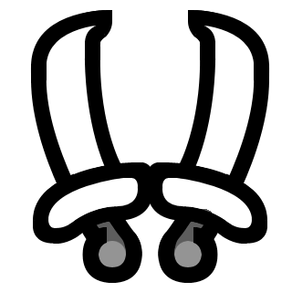
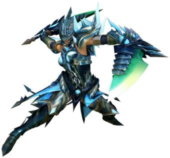

<link rel="stylesheet" href="../../base.css"/>
<link rel="stylesheet" href="https://raw.githubusercontent.com/ZadenOwer/D-D-Resources/main/base.css"/>

# Hojas Duales

Una arma doble que se beneficia de sus habilidades para hacer gran daño de manera constante en sus ataques.



## Estadísticas

- <span style="color:var(--ataque)">1d6</span> de daño ***Cortante*** + Modificador de <span style="color:var(--fuerza)">Fuerza</span> o <span style="color:var(--destreza)">Destreza</span>, por cada cuchilla
- Ligero

## Habilidades

### <span style="color:var(--poco-comun)">Modo Demoníaco</span>

```Condiciones: Solo puede ser usado 2 veces entre descansos largos```

Como una acción bonus, tu cuerpo es envuelto con una aura demoniaca por 30 segundos o hasta que te tumben.

Mientras el efecto permanezca activo, ganas +5 de <span style='color:var(--velocidad)'>velocidad de movimiento</span>, y haces <span style='color:var(--ataque)'>1d4</span> como daño extra en el primer ataque que golpee a una criatura en cada turno.

Una vez que el efecto termine, no podras activarlo hasta dentro de 30 segundos.


### <span style="color:var(--raro)">Mejora del Modo Demoníaco</span>

Ahora puedes usar <span style='color:var(--poco-comun)'>Modo Demoníaco</span> hasta 3 veces entre descansos largos.

La mejora de <span style='color:var(--velocidad)'>velocidad de movimiento</span> aumenta a 10 pies, y ahora haces <span style='color:var(--ataque)'>1d4</span> de daño extra con cada ataque mientras el efecto permanezca activo.

### <span style='color:var(--raro)'>Aflicción (pasiva)</span>

El daño elemental que realizas con esta arma recibe un bono extra de +5% del daño inflingido

### <span style='color:var(--muy-raro)'>Modo Archidemonio</span>

El <span style='color:var(--poco-comun)'>Modo Demoníaco</span> se transforma en <span style='color:var(--muy-raro)'>Modo Archidemonio</span>, puedes usar esta habilidad hasta 4 veces entre descansos largos.

La mejora de <span style='color:var(--velocidad)'>velocidad de movimiento</span> aumenta a 15 pies mientras el efecto permanezca activo y ahora haces <span style='color:var(--ataque)'>1d5</span> de daño extra con cada ataque mientras el efecto permanezca activo..

### <span style='color:var(--muy-raro)'>Mejora de Aflicción</span>

El bono del daño elemental aumenta a +10%

### <span style='color:var(--legendario)'>Mejora de Modo Archidemonio</span>

Puedes usar el <span style='color:var(--muy-raro)'>Modo Archidemonio</span> hasta 5 veces entre descansos largos.

La mejora de <span style='color:var(--velocidad)'>velocidad de movimiento</span> aumenta a 20 pies, y ahora haces <span style='color:var(--ataque)'>1d6</span> de daño extra con cada ataque mientras el efecto permanezca activo.

### <span style='color:var(--legendario)'>Mejora de Aflicción</span>

El bono del daño elemental aumenta a +20%

## Efectos de la rareza del arma

- <span style='color:var(--raro)'>Raro</span>: <span style='color:var(--ataque)'>+1</span> en tiradas de ataque y daño.

- <span style='color:var(--muy-raro)'>Muy Raro</span>: <span style='color:var(--ataque)'>+2</span> en tiradas de ataque y daño.

- <span style='color:var(--legendario)'>Legendario</span>: <span style='color:var(--ataque)'>+3</span> en tiradas de ataque y daño.

