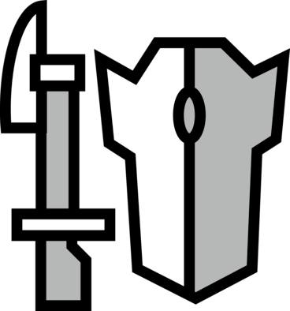
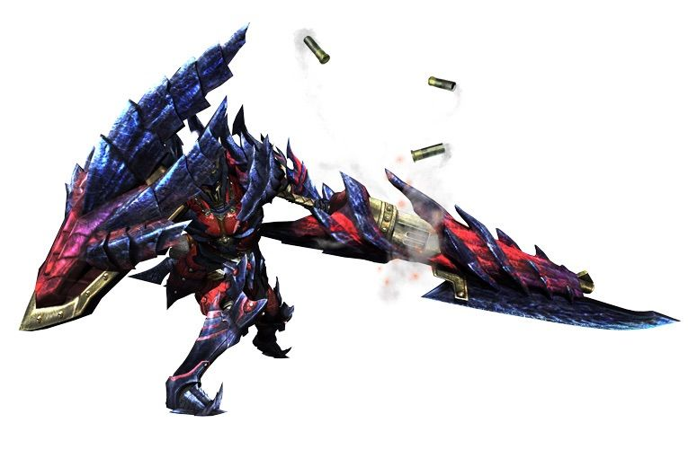

<link rel="stylesheet" href="../../base.css">

# Lanza Pistola

Arma que es tanto defensiva y como ofensiva a largo alcance, tiene poderosos ataques que pueden dejar descoladas a las criaturas enemigas.



## Estadísticas

- <span style="color:var(--ataque)">1d8</span> de daño ***Perforante*** + tu modificador de <span style="color:var(--fuerza)">Fuerza</span> o <span style='color:var(--constitucion)'>Constitución</span>
- +2 AC natural con el arma desenfundada
- Alcance de 2 metros
- Pesada
- A 2 manos

## Habilidades

### Desenfunde Rápido

Cuando desenfundas o recoges esta arma, puedes levantar tu escudo como parte de la misma interacción. Puedes utilizar tu reacción para desenfundar y tratar de bloquear un ataque melee o a distancia mientras estes viendo a tu atacante.

### <span style='color:var(--poco-comun)'>Munición</span>

```Costo: 1 munición```

Tu lanza pistola tiene hasta 3 cargas de munición.

Como una acción, puedes consumir una carga para hacer un ataque melee o a distancia contra un objetivo.

Este ataque tiene un rango de 2 metros a melee, y 12 - 20 metros a distancia, haciendo <span style='color:var(--ataque)'>1d6</span> de daño del elemento de tu arma. Si tu arma no tiene elemento el daño se considera perforante.

Si puedes hacer un multi ataque como acción de ataque, 1 carga consumida equivale a uno de los ataques.

Como acción bonus, puedes recargar 1 munición.

### <span style='color:var(--raro)'>Mejora de Munición</span>

Ahora puedes tener hasta 4 cargas de munición, ademas el daño aumenta a <span style='color:var(--ataque)'>1d8</span>.

### <span style='color:var(--raro)'>Recarga en Guardia</span>

Cuando una criatura falla un ataque a melee contra ti o si bloqueas un ataque con tu reacción, obtienes 1 carga de munición.

### <span style='color:var(--raro)'>Disparo Wyvern</span>

Como una acción bonus, puedes cargar una munición especial en la Lanza Pistola y usar tu acción para liberar llamas en una linea de 6 metros de largo y 1 metro de ancho.

Cada criatura en la linea debe superar una <span style='color:var(--destreza)'>tirada de destreza</span> de <span style='color:var(--ataque)'>8</span> + <span style='color:var(--competencia)'>tu modificador de competencia</span> + <span style='color:var(--ataque)'>tu modificador de daño</span>. Si falla, recibe <span style='color:var(--ataque)'>3d6</span> de daño del elemento de tu arma. Si tu arma no tiene elemento el daño se considera perforante.

Si supera la tirada, recibe la mitad del daño.

No puedes usar esta acción hasta finalizar un descanso largo.

### <span style='color:var(--muy-raro)'>Mejora de Munición</span>

Ahora puedes tener hasta 5 cargas y hacen <span style='color:var(--ataque)'>1d10</span> de daño.

### <span style='color:var(--muy-raro)'>Mejora del Disparo Wyvern</span>

Ahora tiene un rango de 9 metros de largo y hace <span style='color:var(--ataque)'>4d6</span> de daño.

### <span style='color:var(--muy-raro)'>Desplazamiento Explosivo</span>

Mientras tienes esta arma desenfundada puedes desplazarte hasta 1 metro en cualquier dirección.

Puedes usar esta acción un número de veces igual a <span style='color:var(--competencia)'>tu modificador de competencia</span>. Los usos se recuperan después de un descanso corto o uno largo.

### <span style='color:var(--muy-raro)'>Munición Cargada</span>

```Costo: 3 municiones```

Realizas un disparo de municion cargado, al impactar el objetivo deba superar una <span style='color:var(--fuerza)'>tirada de fuerza</span> de <span style='color:var(--ataque)'>8</span> + <span style='color:var(--competencia)'>tu modificador de competencia</span> + <span style='color:var(--ataque)'>tu modificador de daño</span>. Si falla, recibe <span style='color:var(--ataque)'>2d10</span> de daño extra del elemento de tu arma extra y es derribado.

Si supera la tirada, recibe <span style='color:var(--ataque)'>1d10</span> de daño extra del elemento de tu arma.

Si tu arma no tiene elemento el daño se considera perforante.

### <span style='color:var(--legendario)'>Mejora de la Munición Cargada</span>

Ahora hace <span style='color:var(--ataque)'>2d12</span> de daño extra, o <span style='color:var(--ataque)'>1d12</span> si falla.

### <span style='color:var(--legendario)'>Mejora de Munición +2</span>

Ahora los ataques de <span style='color:var(--poco-comun)'>Munición</span> hacen <span style='color:var(--ataque)'>1d12</span> de daño.

### <span style='color:var(--legendario)'>Mejora de Disparo Wyvern +2</span>

Ahora tiene un rango de 12 metros de largo y hace <span style='color:var(--ataque)'>5d6</span> de daño.

## Efectos de la rareza del arma

- <span style='color:var(--raro)'>Raro</span>: <span style='color:var(--ataque)'>+1</span> en tiradas de ataque y daño. <span style='color:var(--ataque)'>+1</span> de AC natural con el arma desenfundada.

- <span style='color:var(--muy-raro)'>Muy Raro</span>: <span style='color:var(--ataque)'>+2</span> en tiradas de ataque y daño. <span style='color:var(--ataque)'>+2</span> de AC natural con el arma desenfundada.

- <span style='color:var(--legendario)'>Legendario</span>: <span style='color:var(--ataque)'>+3</span> en tiradas de ataque y daño. <span style='color:var(--ataque)'>+2</span> de AC natural con el arma desenfundada.

