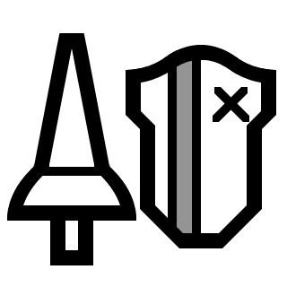
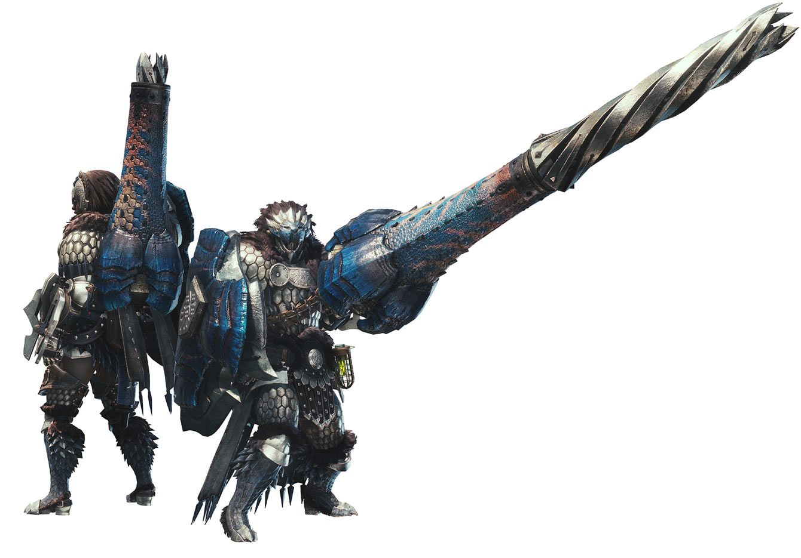

<link rel="stylesheet" href="../../base.css">

# Lanza

El arma de los tanques, bastante defensiva y que se aprovecha de ello al recibir bonos de daños por bloquear en el momento justo y castigar cuando fallan en atacarlo.

## Estadísticas

- 1d8 de daño ***Perforante*** + tu modificador de Fuerza o Constitución
- +2 de AC natural con el arma desenfundada
- Alcance de 2 metros
- Pesada
- A 2 manos

## Habilidades

### Super Guardia

Como una reacción, obtienes +2 de AC contra un ataque melee o a distancia. Para ello, debes estar viendo al atacante mientras tienes desenfundada el arma.

Si bloqueas con éxito obtendras un bonus de daño extra en tu siguente ataque de 1d4

### Carga de Escudo

Puedes moverte hasta 4 metros en linea recta hacia una criatura y realizar un ataque con tu escudo de 1d4 + tu modificador de daño de daño contundente extra.

Esta habilidad no se cuenta como una acción de ataque, sino como una acción de movimiento.

### Mejora de Super Guardia

Ahora obtienes +3 de AC al realizar esta reacción.

El bonus de daño extra aumenta a 1d6.

### Mejora de Carga de Escudo

Ahora tu Carga de Escudo realizara de 2d4 + tu modificador de daño de daño contundente extra.

### Contra Estocada

Como una reacción cuando una criatura falla un ataque a melee contra ti, puedes hacer una oportunidad de ataque contra la criatura en cuestión, esta oportunidad de ataque no utiliza tu reacción.

Puedes usar esta habilidad un número de veces igual a tu modificador de constitucion, recuperas todos los usos al completar un descanso corto o largo.

### Mejora de Super Guardia +2

Ahora obtienes +4 de AC al realizar esta reacción.

El bonus de daño extra aumenta a 1d8.

### Mejora de Carga de Escudo +2

Ahora tu Carga de Escudo realizara de 3d4 + tu modificador de daño de daño contundente extra.

## Efectos de la rareza del arma

- Poco común: +1 en tiradas de ataque y daño.

- Raro: +1 en tiradas de ataque y daño. +1 de AC natural con el arma desenfundada.

- Muy Raro: +2 en tiradas de ataque y daño. +2 de AC natural con el arma desenfundada.

- Legendario: +2 en tiradas de ataque y daño. +3 de AC natural con el arma desenfundada.

