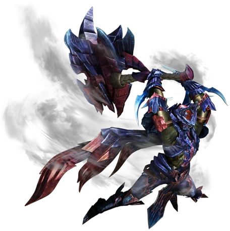

<link rel="stylesheet" href="../../base.css">

# Martillo

Yo unga luego bunga, un arma con buen daño y la capacidad de controlar a las criaturas con sus derribos y aturdimientos.

## Estadísticas

- 2d6 de daño Contundente + Modificador de Fuerza
- Pesada
- A 2 manos

## Habilidades

### Arma Potente

Cuando golpeas con esta arma una criatura que es grande, mediana o pequeña, puedes hacer que deban superar una tirada de constitucion de 8 + tu modificador de competencia + tu modificador de fuerza.

Criaturas grandes tienen ventaja en esta tirada.

Si falla, la criatura será derribada hasta el final de su siguiente turno. Solo puedes utilizar esta acción una vez entre descansos cortos o largos.

### Carga

Si te mueves 4 metros en linea recta hacia una criatura sin recibir daño con el arma desenfundada, tu primer ataque contra ella hace 1d4 de daño contundente extra.

También puedes decidir adquirir una posición de carga al final de tu turno para aplicar el efecto de la habilidad sin tener que moverte, pero esto te dará desventaja a un ataque hasta el inicio de tu siguiente turno. Si te golpean perderás la posición de carga.

### Mejora de Arma Potente

Ahora puedes usar Arma Potente hasta 2 veces entre descansos cortos o largos.

Adicionalmente, cuando golpeas a cualquier criatura sin importar su tamaño, puedes hacer que deban superar la tirada o ser derribados.

Criaturas grandes y gigantes tienen ventaja en la tirada.

### Mejora de Carga

Ahora el ataque hace 2d4 de daño contundente extra.

### Mejora de Arma Potente +2

Ahora puedes usar Arma Potente hasta 3 veces entre descansos cortos o largos.

### Mejora de Carga +2

Ahora el ataque hace 3d4 de daño contundente extra.

Ya no perderas la posición de carga si te golpean.

### Mejora de Arma Potente +3

Ahora puedes usar Arma Potente hasta 4 veces entre descansos cortos o largos.

Las criaturas de gran tamaño ya no tienen ventaja en la tirada.

### Mejora de Carga +3

Ahora el ataque hace 4d4 de daño contundente extra.

Tampoco tienes desventaja al recibir un ataque durante esta posicion.

## Efectos de la rareza del arma

- Raro: +1 en tiradas de ataque y daño.

- Muy Raro: +2 en tiradas de ataque y daño.

- Legendario: +3 en tiradas de ataque y daño.

