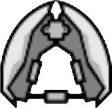
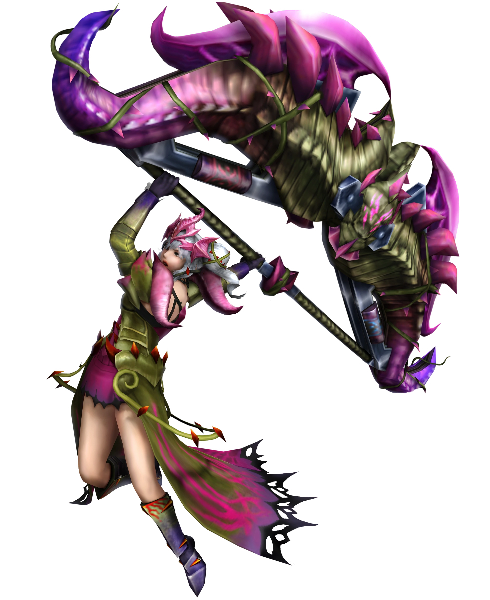

<link rel="stylesheet" href="../../base.css">

# Púa Magnética

Arma única en su tipo utilizada por los cazadores de la frontera, utiliza una extraña técnologia que permite el control del magnetismo para potenciar sus ataques y realizar rápidos movimientos evasivos.

## Estadísticas

- 2d4 de daño ***Cortante***/Contundente + tu modificador de Fuerza o Destreza
- Pesada
- A 2 manos

## Habilidades

### Intercambio

Como una acción Bonus, puedes cambiar el daño del arma entre ***Cortante*** y Contundente

### Arma Magnética

Como parte de tu acción de ataque, puedes disparar una esfera magnética a una criatura u objeto a una distancia entre 6 y 12 metros usando tu modificador de Fuerza o Destreza.

Al golpear, el objetivo recibe 1d4 de daño perforante y la esfera magnética se pega al objetivo por 1 minuto, hasta que la recuperes como una acción bonus, el objetivo muera o sea destruido.

Si puedes hacer un ataque multiple con tu acción de ataque,este ataque se considera como uno de ellos.

### Impulso Magnético

Una criatura u objeto golpeado con esta arma se magnetiza por 1 minuto o hasta que tu ataques a un nuevo objetivo.

Mientras este magnetizado, el tamaño del dado utilizado para calcular el daño de esta arma incrementa en 1 por cada golpe que realizas contra el objetivo magnetizado, hasta llegar a un maximo de 2d6.

### Asalto Magnético

Cuando estas a una distancia entre 5 - 10 metros de una criatura u objeto que tiene una esfera magnética pegada, puedes usar una acción bonus para jalarte hacia un espacio desocupado a 1 metro del objetivo.

### Mejora del Impulso Magnético

Ahora puedes llegar a un máximo de 2d8 en tu dado de cálculo de daño.

### Evasión Magnética

Cuando eres el objetivo de un ataque de una criatura u objeto con una esfera magnética pegada, puedes usar tu reacción para jalarte a ti mismo y desplazarte 2 metros lejos del atacante.

Puedes realizar esta acción un número de veces igual a tu modificador de daño, recuperas todos los usos cuando finalizas un descanso largo o corto.

### Mejora del Asalto Magnético

Ahora puedes jalarte desde una distancia entre 5 - 12 metros, ademas esto no genera ataque de oportunidad.

### Mejora de la Evasión Magnética

Cuando te alejas de la criatura que esta atacando al usar Evasión Magnética, si todavía estuvieras dentro del rango del ataque, este es realizado con desventaja sobre tí.

### Agarre Magnético

Cuando estas a 1 metro de distancia de un objetivo con una esfera magnética pegada, puedes usar una acción para atar el objetivo dentro de un fuerte campo magnético.

El objetivo debe superar una tirada de constitución de 8 + tu modificador de daño + tu modificador de competencia o será incapacitado por 1 minuto.

En tus turnos siguientes, debes usar tu acción para mantener el control sobre el campo magnético, o el efecto terminará.

El objetivo puede repetir la tirada al final de cada uno de sus turnos, si supera, el efecto terminará. Una vez utilizas esta acción, no puedes usarla de nuevo hasta completar un descanso largo.

### Mejora del Asalto Magnético

Ahora puedes jalarte desde una distancia entre 5 - 16 metros.

### Mejora del Impulso Magnético

Ahora puedes llegar a un máximo de 2d10 en tu dado de cálculo de daño.

### Mejora del Agarre Magnético

Ahora puedes utilizar Agarre Magnético 1 vez más entre descansos largos.

## Efectos de la rareza del arma

- Poco común y Raro: +1 en tiradas de ataque y daño.

- Muy Raro: +2 en tiradas de ataque y daño.

- Legendario: +3 en tiradas de ataque y daño.

