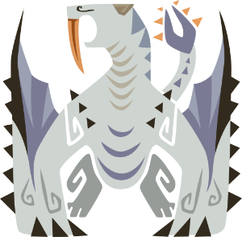
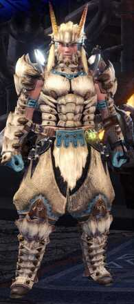
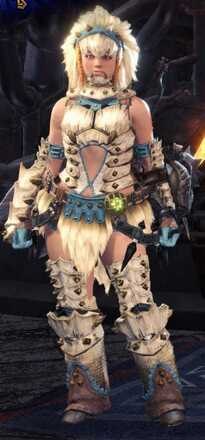

<link rel="stylesheet" href="../../../base.css">

# Barioth

Un wyvern volador que acecha en las tundras y montañas nevadas.

## Armas

Las armas de Barioth son de elemento Hielo.

## Armadura

<table>
  <thead>
    <tr>
      <th>Elemento</th>
      <th>Nivel de Resistencia</th>
    </tr>
  </thead>
  <tbody>
    <tr>
      <td>Fuego</td>
      <td>-3 ✪</td>
    </tr>
    <tr>
      <td>Rayo</td>
      <td>-2 ✪</td>
    </tr>
    <tr>
      <td>Hielo</td>
      <td>+3 ✪</td>
    </tr>
  </tbody>
</table>

### Habilidades

<table>
  <tr>
    <td>Adrenalina</td>
    <td>Tu Velocidad de Movimiento aumenta en 5 metros y tienes ventaja en tiradas de Destreza.</td>
  </tr>
</table>