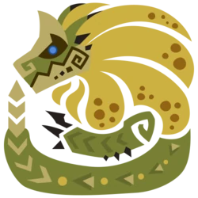
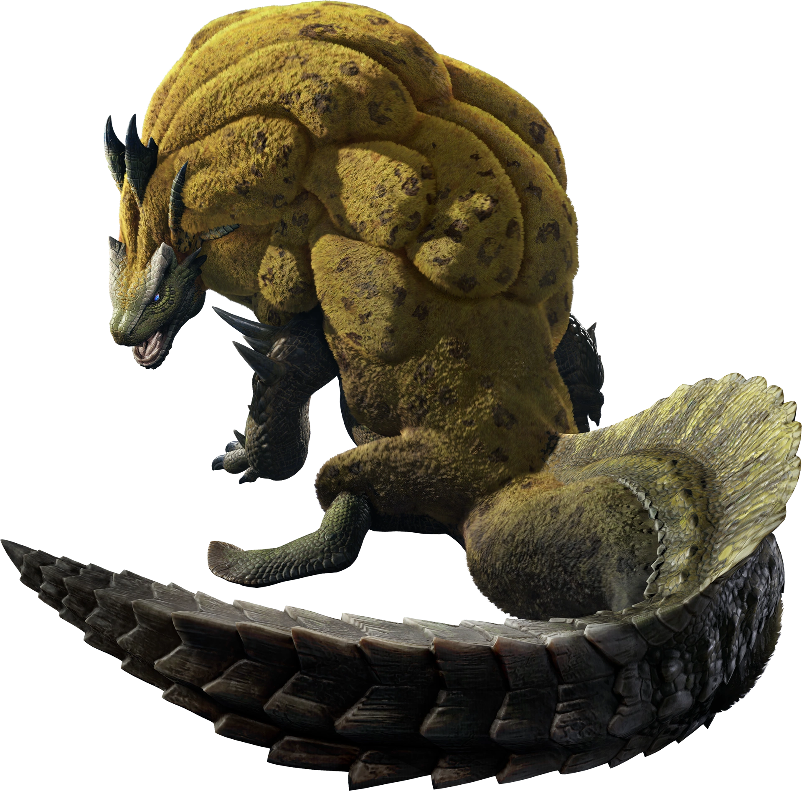
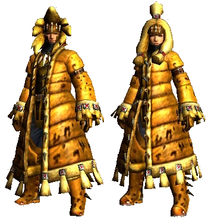

<link rel="stylesheet" href="../../../base.css">

# Ludroth Real

Un leviathan famoso por su melena que asemeja una esponja ya que absorbe grandes cantidad de agua.

## Armas

Las armas de Ludroth son de elemento Agua.

## Armadura

<table>
  <thead>
    <tr>
      <th>Elemento</th>
      <th>Nivel de Resistencia</th>
    </tr>
  </thead>
  <tbody>
    <tr>
      <td>Fuego</td>
      <td>-3 ✪</td>
    </tr>
    <tr>
      <td>Rayo</td>
      <td>-1 ✪</td>
    </tr>
    <tr>
      <td>Agua</td>
      <td>+3 ✪</td>
    </tr>
  </tbody>
</table>

### Habilidades

<table>
  <tr>
    <td>Plena Forma</td>
    <td>Mientras estas a vida máxima, recibes un bonus en tiradas de ataque y daño de 1d4.</td>
  </tr>
</table>