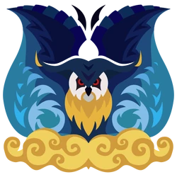

<link rel="stylesheet" href="../../../base.css">

# Malfestio

Un wyvern volador que usa un tipo de hipnosis para dormir y confundir a sus presas.

## Armas

Las armas de Malfestio son de estado Sueño.

## Armadura

<table>
  <thead>
    <tr>
      <th>Elemento</th>
      <th>Nivel de Resistencia</th>
    </tr>
  </thead>
  <tbody>
    <tr>
      <td>Fuego</td>
      <td>-2 ✪</td>
    </tr>
    <tr>
      <td>Agua</td>
      <td>-2 ✪</td>
    </tr>
    <tr>
      <td>Hielo</td>
      <td>+1 ✪</td>
    </tr>
  </tbody>
</table>

### Habilidades

<table>
  <tr>
    <td>Resistencia a estados</td>
    <td>Obtienes un bonus de 1d4 en tus tiradas de salvación por estados alterados.</td>
  </tr>
</table>