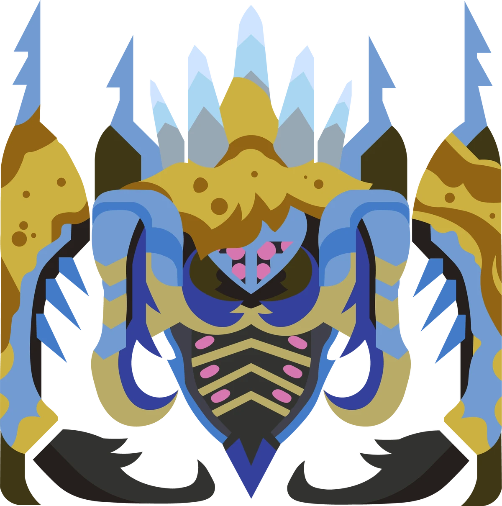
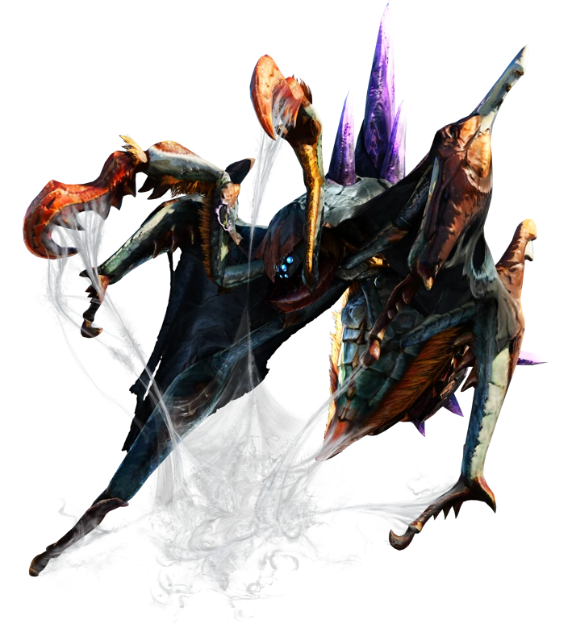
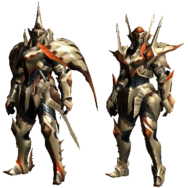

<link rel="stylesheet" href="../../../base.css">

# Nerscylla

Un temnoceran, un monstruo arácnido capaz de atacar con distintos estados alterados.

## Armas

Las armas de Nerscylla son de estado alterado Parálisis.

## Armadura

<table>
  <thead>
    <tr>
      <th>Elemento</th>
      <th>Nivel de Resistencia</th>
    </tr>
  </thead>
  <tbody>
    <tr>
      <td>Rayo</td>
      <td>-2 ✪</td>
    </tr>
    <tr>
      <td>Agua</td>
      <td>+2 ✪</td>
    </tr>
    <tr>
      <td>Draco</td>
      <td>+2 ✪</td>
    </tr>
  </tbody>
</table>

### Habilidades

<table>
  <tr>
    <td>Ataques de Estado</td>
    <td>Si tu ataque fuera a producir un estado alterado en el monstruo, adquieres un bonus de 1d4 en la tirada de salvacion que debe superarse.</td>
  </tr>
</table>