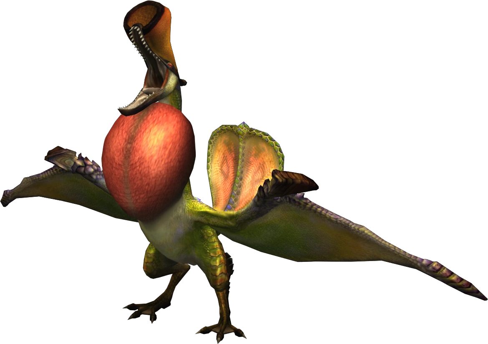

<link rel="stylesheet" href="../../../base.css">

# Qurupeco

Un wyvern volador el cual utiliza su organo especial para darse efectos beneficos o atraer otros monstruos.

## Armas

Las armas de Qurupeco no tienen elemento.

## Armadura

<table>
  <thead>
    <tr>
      <th>Elemento</th>
      <th>Nivel de Resistencia</th>
    </tr>
  </thead>
  <tbody>
    <tr>
      <td>Hielo</td>
      <td>-3 ✪</td>
    </tr>
    <tr>
      <td>Agua</td>
      <td>-1 ✪</td>
    </tr>
    <tr>
      <td>Fuego</td>
      <td>+2 ✪</td>
    </tr>
  </tbody>
</table>

### Habilidades

<table>
  <tr>
    <td>Recuperación aumentada</td>
    <td>Cuando te curas obtienes un bonus de curación de 1d6.</td>
  </tr>
</table>