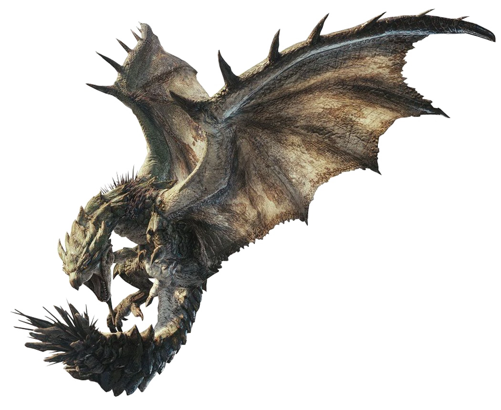
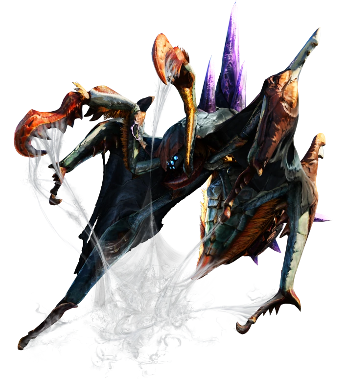
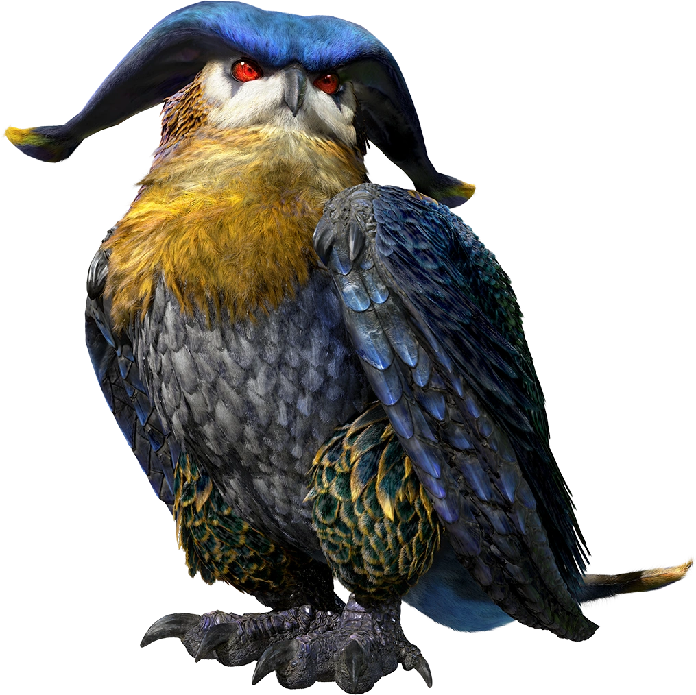

<link rel="stylesheet" href="../../base.css">

# Rango ✪✪✪ (3)

## [Barioth](Barioth/Barioth.html)

Un wyvern volador que acecha en las tundras y montañas nevadas.

## [Rathian](Rathian/Rathian.html)

Un wyvern volador conocida como la "Reina de las llanuras", es la hembra de los Rath.

## [Ludroth Real](Ludroth%20Real/Ludroth%20Real.html)

Un leviathan famoso por su melena que asemeja una esponja ya que absorbe grandes cantidad de agua.

## [Qurupeco](Qurupeco/Qurupeco.html)

Un wyvern volador el cual utiliza su organo especial para darse efectos beneficos o atraer otros monstruos.

## [Nerscylla](Nerscylla/Nerscylla.html)

Un temnoceran, un monstruo arácnido capaz de atacar con distintos estados alterados.

## [Malfestio](Malfestio/Malfestio.html)

Un wyvern volador que usa un tipo de hipnosis para dormir y confundir a sus presas.

## [Tobi Kadachi](Tobi%20Kadachi/Tobi%20Kadachi.html)

Un wyvern de colmillos bastante agil, se mueve entre los árboles y ataca con su cola electrificada.

