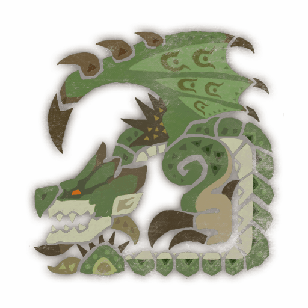
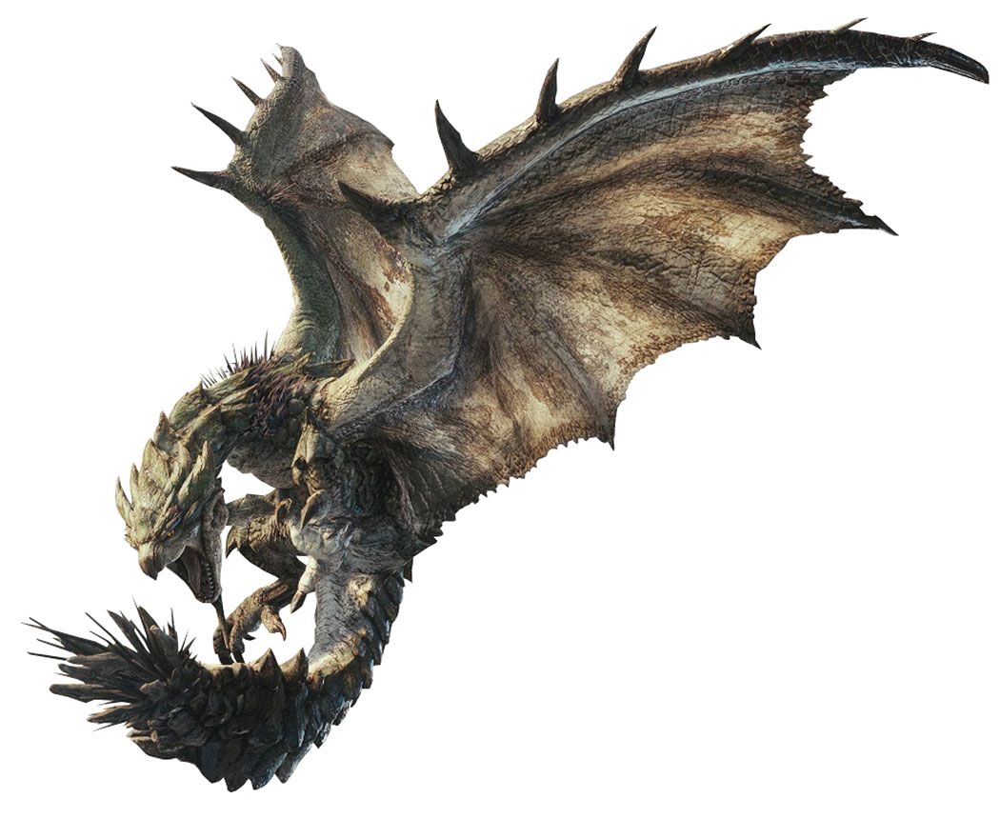
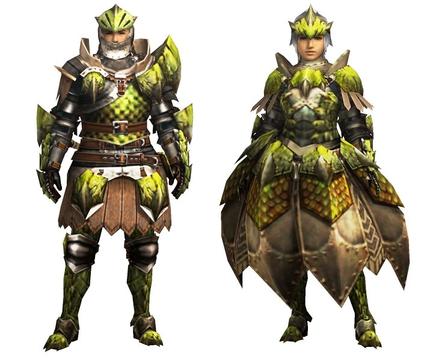

<link rel="stylesheet" href="../../../base.css">

# Rathian

Un wyvern volador conocida como la "Reina de las llanuras", es la hembra de los Rath.

## Armas

Las armas de Rathian son de elemento Fuego o de Veneno.

## Armadura

<table>
  <thead>
    <tr>
      <th>Elemento</th>
      <th>Nivel de Resistencia</th>
    </tr>
  </thead>
  <tbody>
    <tr>
      <td>Draco</td>
      <td>-3 ✪</td>
    </tr>
    <tr>
      <td>Rayo</td>
      <td>-2 ✪</td>
    </tr>
    <tr>
      <td>Fuego</td>
      <td>+2 ✪</td>
    </tr>
  </tbody>
</table>

### Habilidades

<table>
  <tr>
    <td>Bonus de vida</td>
    <td>Aumenta tu Vida Máxima en 2 Hit Dice + tu valor de Constitución.</td>
  </tr>
</table>