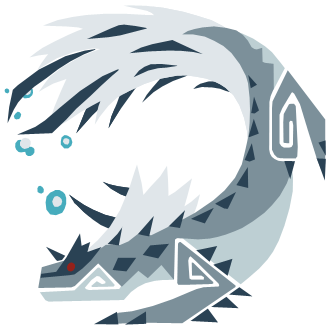
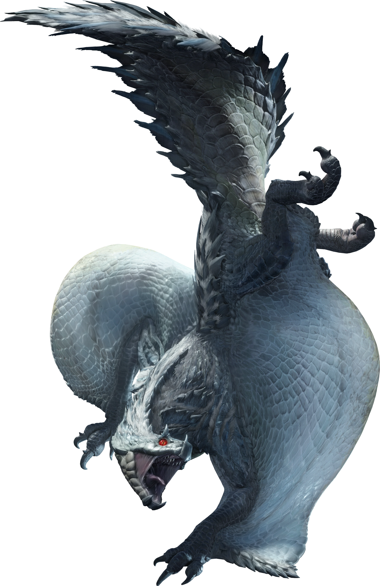
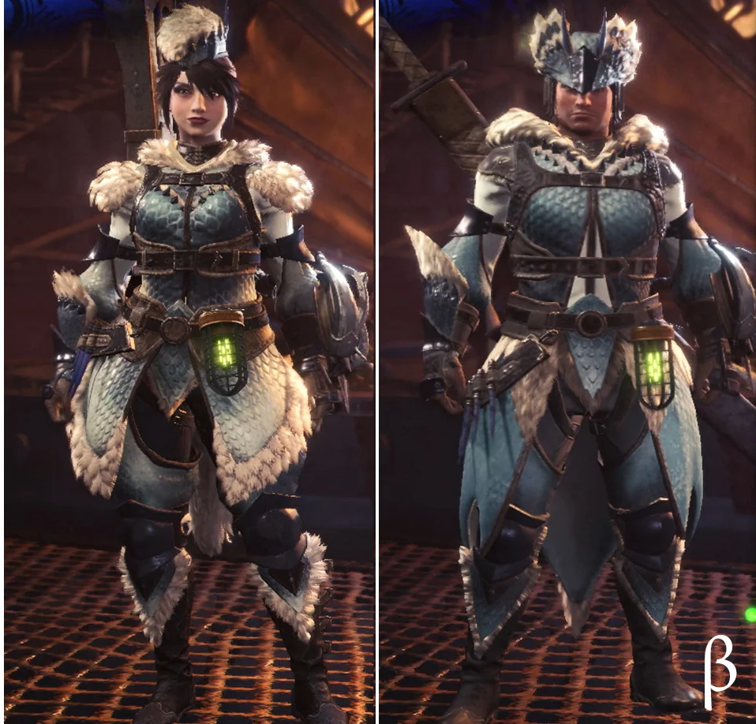

<link rel="stylesheet" href="../../../base.css">

# Tobi Kadachi

Un wyvern de colmillos bastante agil, se mueve entre los árboles y ataca con su cola electrificada.

## Armas

Las armas de Tobi Kadachi son de elemento Rayo.

## Armadura

<table>
  <thead>
    <tr>
      <th>Elemento</th>
      <th>Nivel de Resistencia</th>
    </tr>
  </thead>
  <tbody>
    <tr>
      <td>Agua</td>
      <td>-3 ✪</td>
    </tr>
    <tr>
      <td>Rayo</td>
      <td>+3 ✪</td>
    </tr>
  </tbody>
</table>

### Habilidades

<table>
  <tr>
    <td>Evasión</td>
    <td>Cuando evades o recibes un ataque, 1 vez por turno, puedes moverte hasta 2 metros lejos de tu posicion original sin generar ataque de oportunidad.</td>
  </tr>
</table>