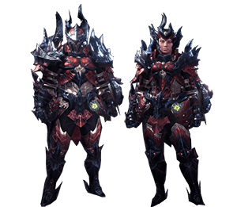

<link rel="stylesheet" href="../../../base.css">

# Glavenus

Un wyvern bruto con una cola de lo mas peculiar, con forma de espada es capaz de afilar y calentar su cola para hacer devastadores ataques. 

## Fisiología

<table>
  <thead>
    <tr>
      <th>Elemento / Estado Alterado</th>
      <th>Nivel de Resistencia</th>
    </tr>
  </thead>
  <tbody>
    <tr>
      <td>Agua</td>
      <td>-3 ✪</td>
    </tr>
    <tr>
      <td>Hielo</td>
      <td>-2 ✪</td>
    </tr>
    <tr>
      <td>Aturdimiento</td>
      <td>-2 ✪</td>
    </tr>
  </tbody>
</table>

### Partes Rompibles

## Armas

Las Armas de Glavenus son de elemento Fuego.

## Armadura

<table>
  <thead>
    <tr>
      <th>Elemento</th>
      <th>Nivel de Resistencia</th>
    </tr>
  </thead>
  <tbody>
    <tr>
      <td>Agua</td>
      <td>-3 ✪</td>
    </tr>
    <tr>
      <td>Hielo</td>
      <td>-1 ✪</td>
    </tr>
    <tr>
      <td>Fuego</td>
      <td>+3 ✪</td>
    </tr>
  </tbody>
</table>

### Habilidades

<table>
  <tr>
    <td>Filo de Cuchilla</td>
    <td>El daño cortante que realizas recibe un bonus de 1d4.</td>
  </tr>
</table>