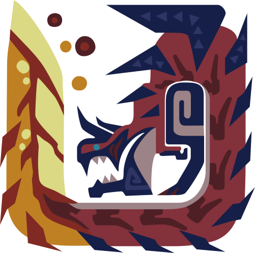
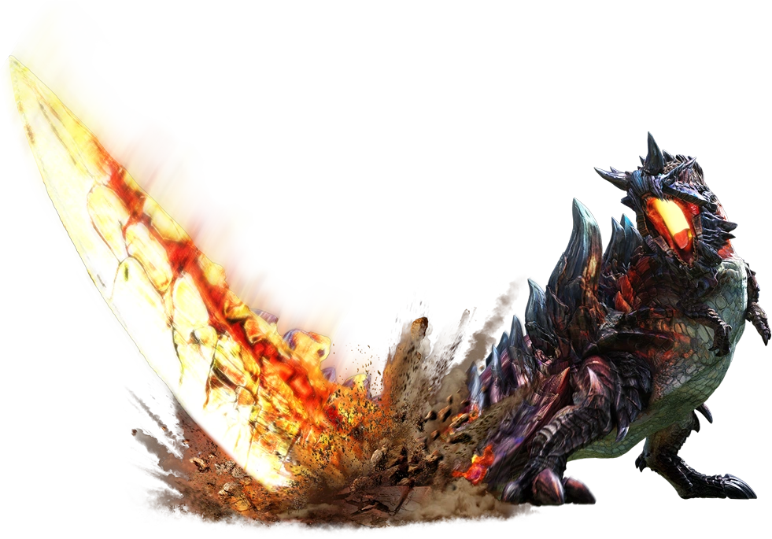
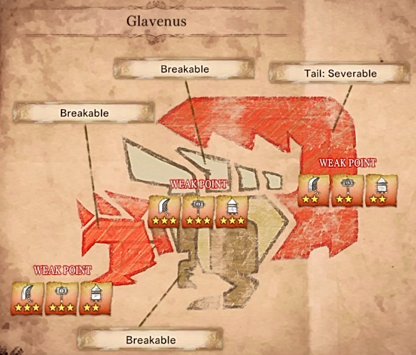

<link rel="stylesheet" href="../../../base.css">

# Glavenus

Un wyvern bruto con una cola de lo mas peculiar, con forma de espada es capaz de afilar y calentar su cola para hacer devastadores ataques. 

## Fisiología

<table>
  <thead>
    <tr>
      <th>Elemento / Estado Alterado</th>
      <th>Nivel de Resistencia</th>
    </tr>
  </thead>
  <tbody>
    <tr>
      <td>Agua</td>
      <td>-3 ✪</td>
    </tr>
    <tr>
      <td>Hielo</td>
      <td>-2 ✪</td>
    </tr>
    <tr>
      <td>Aturdimiento</td>
      <td>-2 ✪</td>
    </tr>
  </tbody>
</table>

### Partes Rompibles

