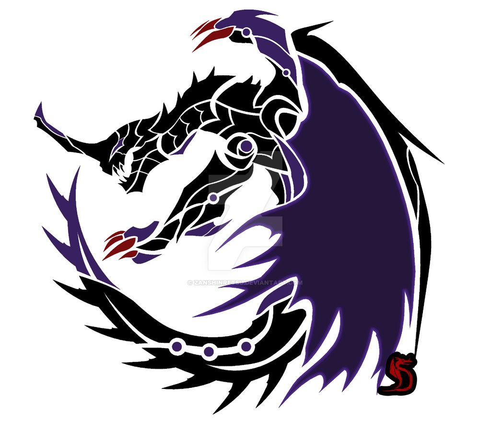
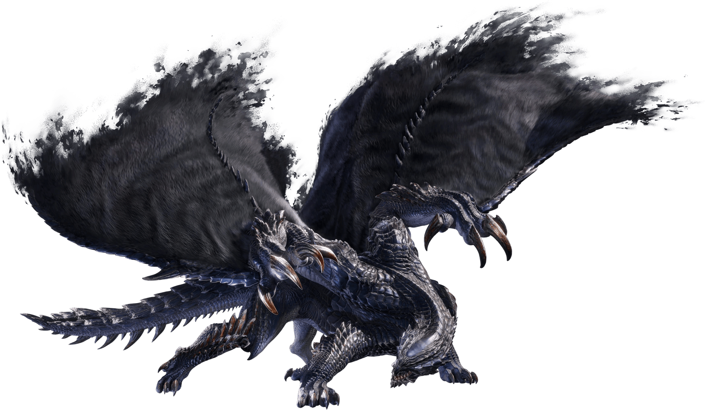
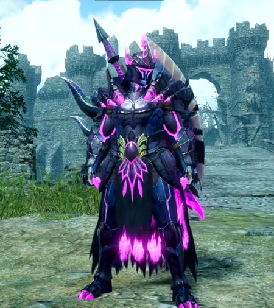
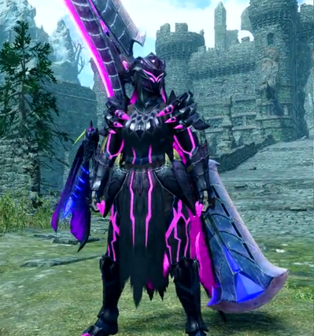

<link rel="stylesheet" href="../../../base.css">

# Gore Magala

Sin una categoria establecida por parte del gremio, esta criatura es bastante misteriosa y sus avistamientos se cuentan con una sola mano. Se dice que es portador de una extraña enfermedad virulenta y puede asolar regiones enteras con solo pasar por ahi.

## Fisiología

<table>
  <thead>
    <tr>
      <th>Elemento / Estado Alterado</th>
      <th>Nivel de Resistencia</th>
    </tr>
  </thead>
  <tbody>
    <tr>
      <td>Fuego</td>
      <td>-3 ✪</td>
    </tr>
    <tr>
      <td>Rayo</td>
      <td>-2 ✪</td>
    </tr>
    <tr>
      <td>Agua</td>
      <td>Inmune</td>
    </tr>
    <tr>
      <td>Aturdimiento</td>
      <td>-2 ✪</td>
    </tr>
  </tbody>
</table>

### Partes Rompibles
<table>
  <thead>
    <tr>
      <th>Parte</th>
      <th>Cortante</th>
      <th>Contundente</th>
      <th>Perforante</th>
    </tr>
  </thead>
  <tbody>
    <tr>
      <td>Cabeza</td>
      <td>✪✪✪</td>
      <td>✪✪</td>
      <td>✪✪</td>
    </tr>
    <tr>
      <td>Brazo Alas</td>
      <td>✪✪</td>
      <td>✪✪</td>
      <td>✪✪</td>
    </tr>
    <tr>
      <td>Cola</td>
      <td>✪✪</td>
      <td>✪✪</td>
      <td>✪✪</td>
    </tr>
  </tbody>
</table>

## Armas

Las Armas de Gore Magala son de elemento Draco.

## Armadura

<table>
  <thead>
    <tr>
      <th>Elemento</th>
      <th>Nivel de Resistencia</th>
    </tr>
  </thead>
  <tbody>
    <tr>
      <td>Fuego</td>
      <td>-2 ✪</td>
    </tr>
    <tr>
      <td>Rayo</td>
      <td>-2 ✪</td>
    </tr>
    <tr>
      <td>Agua</td>
      <td>+3 ✪</td>
    </tr>
  </tbody>
</table>

### Habilidades

<table>
  <tr>
    <td>Coalescencia</td>
    <td>Al salir de un estado alterado (excepto aturdimiento), tus próximos 3 ataques reciben un bonus en tiradas de ataque y daño de 1d6.</td>
  </tr>
</table>
