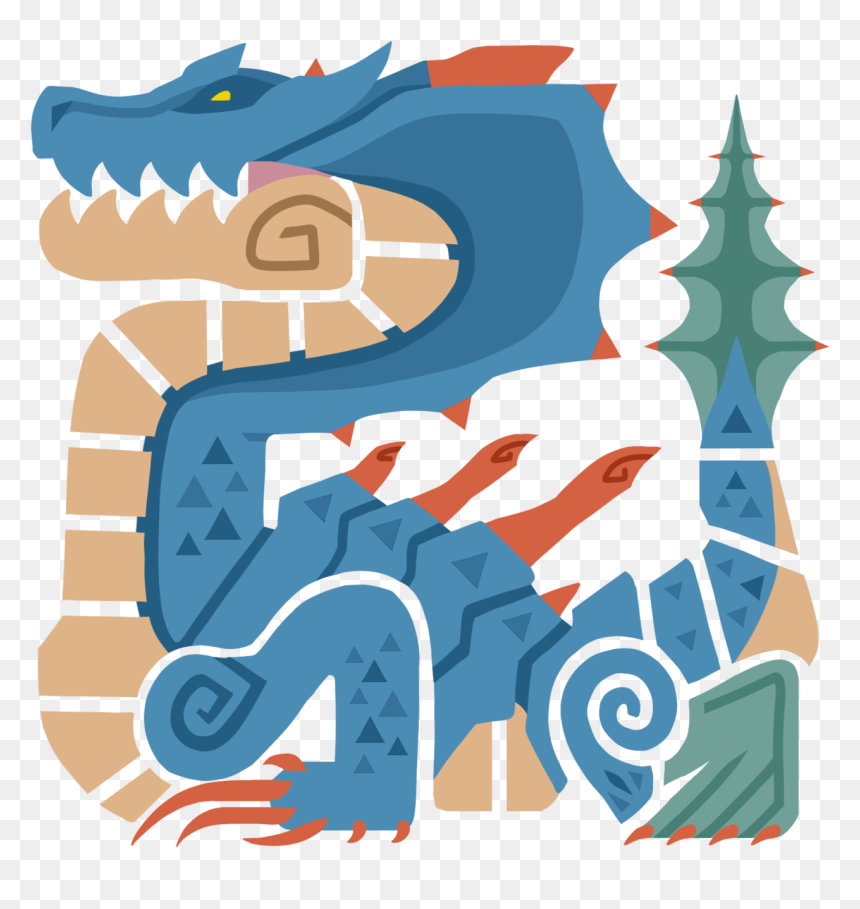
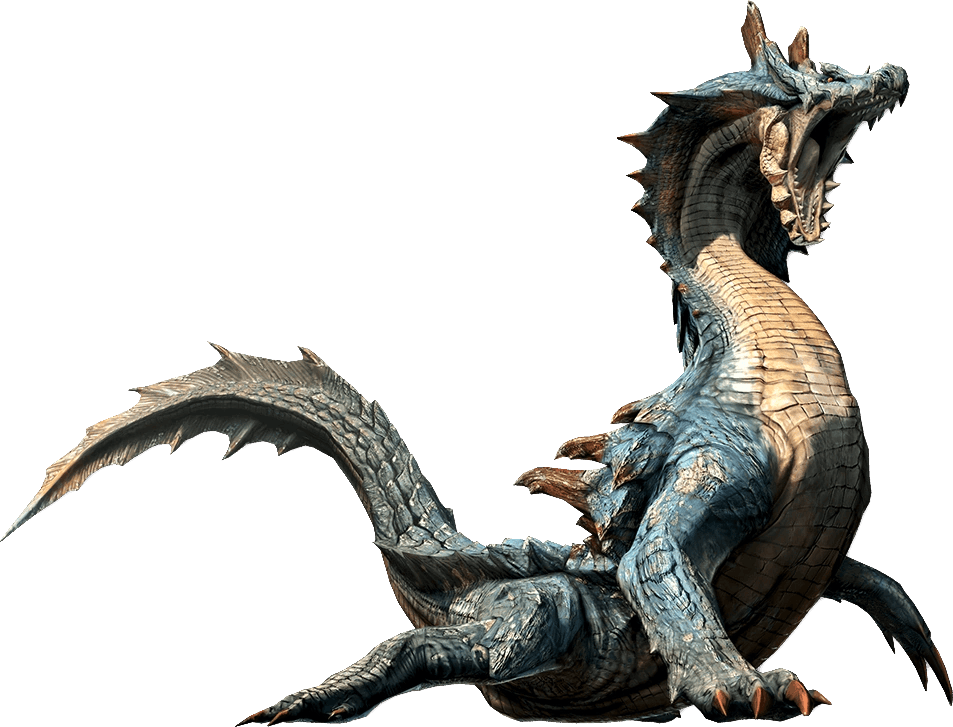

<link rel="stylesheet" href="../../../base.css">

# Lagiacrus

Un leviatán que domina los mares, a pesar de su naturaleza acuatica se mueve perfectamente sobre la tierra. Es capaz de generar poderosos ataques eléctricos.

## Fisiología

<table>
  <thead>
    <tr>
      <th>Elemento / Estado Alterado</th>
      <th>Nivel de Resistencia</th>
    </tr>
  </thead>
  <tbody>
    <tr>
      <td>Fuego</td>
      <td>-2 ✪</td>
    </tr>
    <tr>
      <td>Draco</td>
      <td>-1 ✪</td>
    </tr>
    <tr>
      <td>Aturdimiento</td>
      <td>-2 ✪</td>
    </tr>
  </tbody>
</table>

### Partes Rompibles
<table>
  <thead>
    <tr>
      <th>Parte</th>
      <th>Cortante</th>
      <th>Contundente</th>
      <th>Perforante</th>
    </tr>
  </thead>
  <tbody>
    <tr>
      <td>Cabeza</td>
      <td>✪✪✪</td>
      <td>✪✪✪</td>
      <td>✪✪✪</td>
    </tr>
    <tr>
      <td>Patas delanteras</td>
      <td>✪✪</td>
      <td>✪✪</td>
      <td>✪</td>
    </tr>
    <tr>
      <td>Espalda</td>
      <td>✪✪</td>
      <td>✪✪✪</td>
      <td>✪</td>
    </tr>
    <tr>
      <td>Cola</td>
      <td>✪✪</td>
      <td>✪✪✪</td>
      <td>✪</td>
    </tr>
  </tbody>
</table>