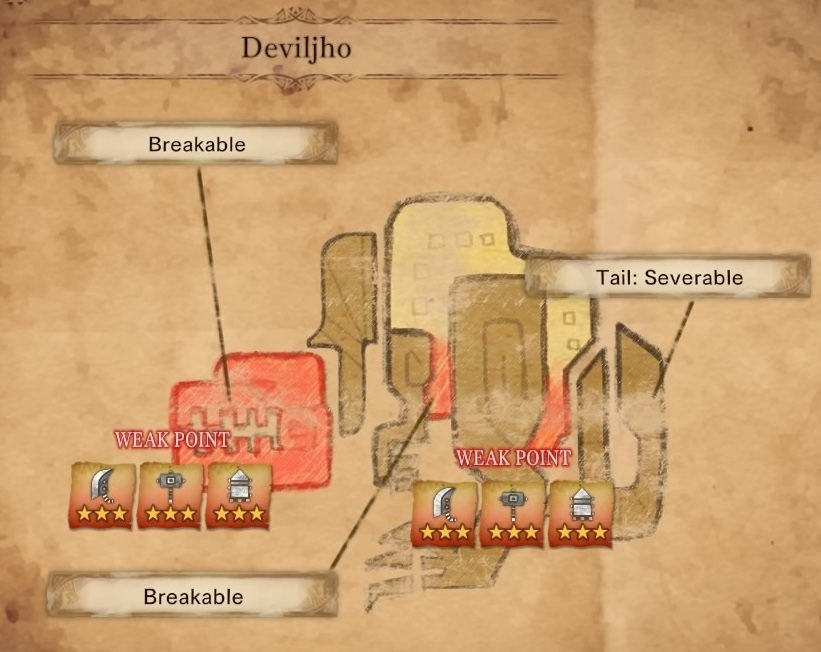
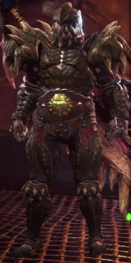
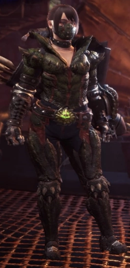

<link rel="stylesheet" href="../../../base.css">

# Deviljho

Un wyvern bruto aterrador, con un hambre insasiable ataca todo lo que se le pasa por delante, utiliza su enorme cuerpo para embestir y atacar.

## Fisiología

<table>
  <thead>
    <tr>
      <th>Elemento / Estado Alterado</th>
      <th>Nivel de Resistencia</th>
    </tr>
  </thead>
  <tbody>
    <tr>
      <td>Rayo</td>
      <td>-3 ✪</td>
    </tr>
    <tr>
      <td>Draco</td>
      <td>-3 ✪</td>
    </tr>
    <tr>
      <td>Aturdimiento</td>
      <td>-2 ✪</td>
    </tr>
  </tbody>
</table>

### Partes Rompibles

## Armas

Las Armas de Deviljho son de elemento Draco.

## Armadura

<table>
  <thead>
    <tr>
      <th>Elemento</th>
      <th>Nivel de Resistencia</th>
    </tr>
  </thead>
  <tbody>
    <tr>
      <td>Rayo</td>
      <td>-3 ✪</td>
    </tr>
    <tr>
      <td>Draco</td>
      <td>-3 ✪</td>
    </tr>
    <tr>
      <td>Hielo</td>
      <td>+1 ✪</td>
    </tr>
  </tbody>
</table>

### Habilidades

<table>
  <tr>
    <td>Romperpartes</td>
    <td>El daño para romperpartes que infliges aumenta en un 20% (ver sección <a href="../../../Mecanicas/Romper%20Partes/Romper%20Partes.html">Romper Partes</a>).</td>
  </tr>
</table>