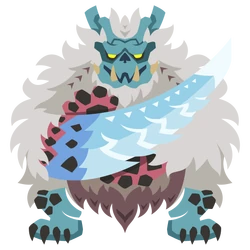
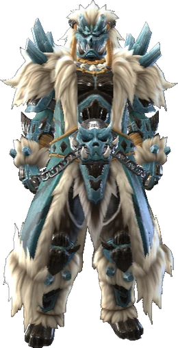
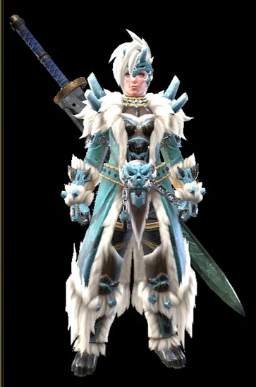

<link rel="stylesheet" href="../../../base.css">

# Goss Harag

Una bestia de colmillos que acecha en la nieve, utiliza su aliento de hielo para crear sobre sus brazos espadas de hielo y es capaz de generar ondas de choque al golpear el piso.

## Fisiología

<table>
  <thead>
    <tr>
      <th>Elemento / Estado Alterado</th>
      <th>Nivel de Resistencia</th>
    </tr>
  </thead>
  <tbody>
    <tr>
      <td>Fuego</td>
      <td>-3 ✪</td>
    </tr>
    <tr>
      <td>Rayo</td>
      <td>-2 ✪</td>
    </tr>
    <tr>
      <td>Aturdimiento</td>
      <td>-1 ✪</td>
    </tr>
  </tbody>
</table>

### Partes Rompibles
<table>
  <thead>
    <tr>
      <th>Parte</th>
      <th>Cortante</th>
      <th>Contundente</th>
      <th>Perforante</th>
    </tr>
  </thead>
  <tbody>
    <tr>
      <td>Cabeza</td>
      <td>✪✪✪</td>
      <td>✪✪✪</td>
      <td>✪✪</td>
    </tr>
    <tr>
      <td>Patas delanteras</td>
      <td>✪✪✪</td>
      <td>✪✪✪</td>
      <td>✪</td>
    </tr>
  </tbody>
</table>

## Armas

Las Armas de Goss Harag son de elemento Hielo.

## Armadura

<table>
  <thead>
    <tr>
      <th>Elemento</th>
      <th>Nivel de Resistencia</th>
    </tr>
  </thead>
  <tbody>
    <tr>
      <td>Fuego</td>
      <td>-3 ✪</td>
    </tr>
    <tr>
      <td>Rayo</td>
      <td>-1 ✪</td>
    </tr>
    <tr>
      <td>Hielo</td>
      <td>+3 ✪</td>
    </tr>
  </tbody>
</table>

### Habilidades

<table>
  <tr>
    <td>Resentimiento</td>
    <td>Si recibes daño de un ataque mientras estas con tu vida completa, tus siguientes 3 ataques reciben un bonus de daño de 2d4.</td>
  </tr>
</table>