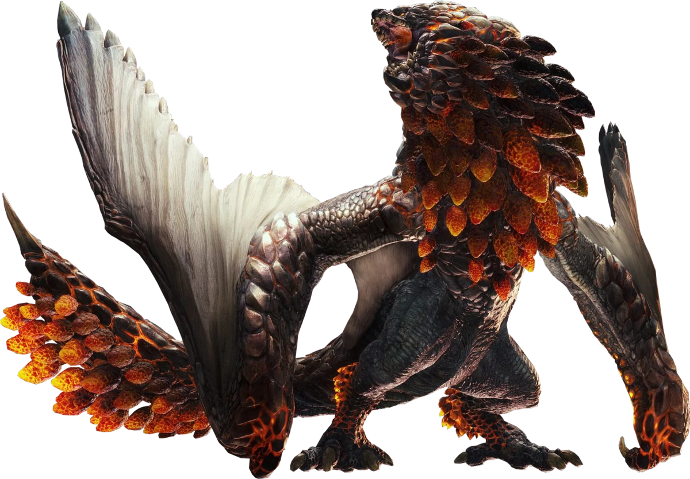
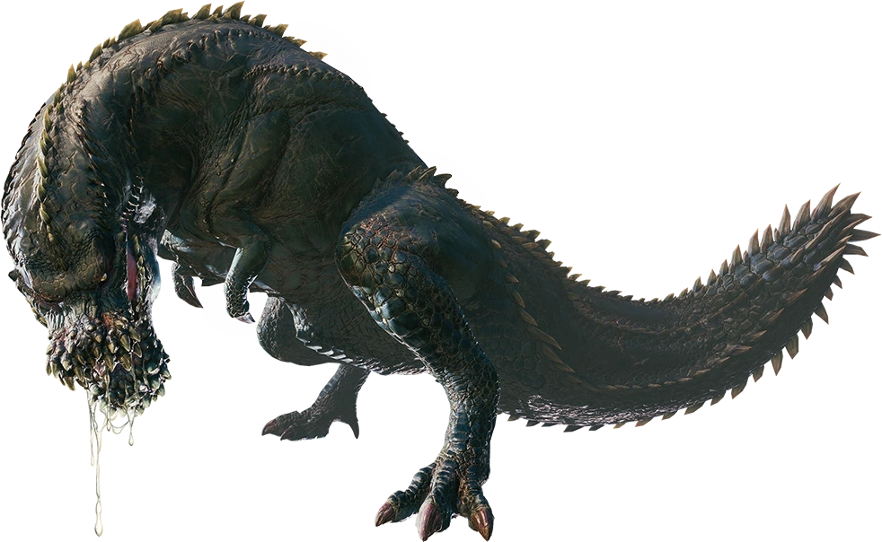

<link rel="stylesheet" href="../../base.css">

# Rango ✪✪✪✪✪ (5)

## [Bazelgeuse](Bazelgeuse/Bazelgeuse.html)

Un wyvern volador bastante agresivo, genera una sustancia explosiva con la que crea escamas que puede lanzar y explotan al cabo de un momento. 

## [Deviljho](Deviljho/Deviljho.html)

Un wyvern bruto aterrador, con un hambre insasiable ataca todo lo que se le pasa por delante, utiliza su enorme cuerpo para embestir y atacar.

## [Goss Harag](Goss%20Harag/Goss%20Harag.html)

Una bestia de colmillos que acecha en la nieve, utiliza su aliento de hielo para crear sobre sus brazos espadas de hielo y es capaz de generar ondas de choque al golpear el piso.

