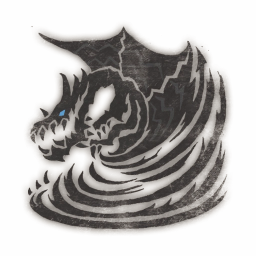
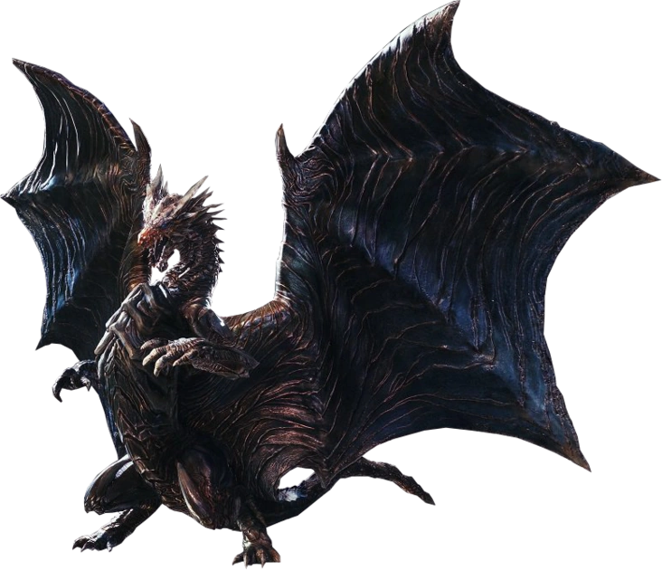
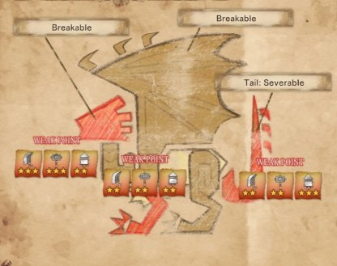
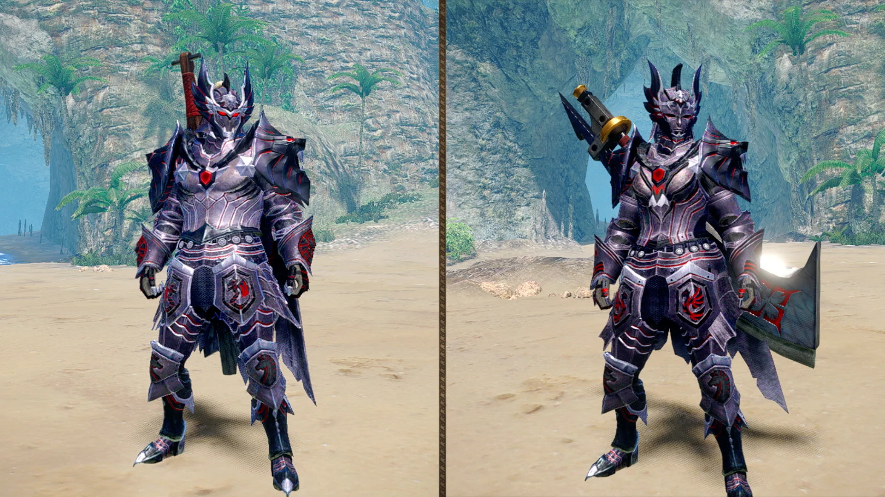

<link rel="stylesheet" href="../../../base.css">

# Kushala Daora

Un dragón anciano con escamas metálicas y la capacidad de controlar el viento a voluntad, genera barreras de viento para defenderse y poderosos tornados para controlar el campo de batalla.

## Fisiología

Kushala Daora es suceptible al Veneno, obligandolo a no poder volar y reduciendo sus capacidades defensivas al no poder generar barreras de viento temporalmente.

<table>
  <thead>
    <tr>
      <th>Elemento / Estado Alterado</th>
      <th>Nivel de Resistencia</th>
    </tr>
  </thead>
  <tbody>
    <tr>
      <td>Rayo</td>
      <td>-3 ✪</td>
    </tr>
    <tr>
      <td>Draco</td>
      <td>-2 ✪</td>
    </tr>
    <tr>
      <td>Hielo</td>
      <td>Inmune</td>
    </tr>
    <tr>
      <td>Aturdimiento</td>
      <td>-2 ✪</td>
    </tr>
  </tbody>
</table>

### Partes Rompibles

## Armas

Las Armas de Kushala Daora son de elemento Hielo.

## Armadura

<table>
  <thead>
    <tr>
      <th>Elemento</th>
      <th>Nivel de Resistencia</th>
    </tr>
  </thead>
  <tbody>
    <tr>
      <td>Draco</td>
      <td>-2 ✪</td>
    </tr>
    <tr>
      <td>Rayo</td>
      <td>-2 ✪</td>
    </tr>
    <tr>
      <td>Hielo</td>
      <td>+3 ✪</td>
    </tr>
    <tr>
      <td>Agua</td>
      <td>+3 ✪</td>
    </tr>
  </tbody>
</table>

### Habilidades

<table>
  <tr>
    <td>Maniobras Evasivas</td>
    <td>Si fueras a recibir un ataque, recibes un bonus en tu tirada de salvación de 1d8.</td>
  </tr>
  <tr>
    <td>Bendición de Kushala Daora</td>
    <td>El daño elemental de hielo y agua que realizas recibe un bonus de 1d8.</td>
  </tr>
</table>