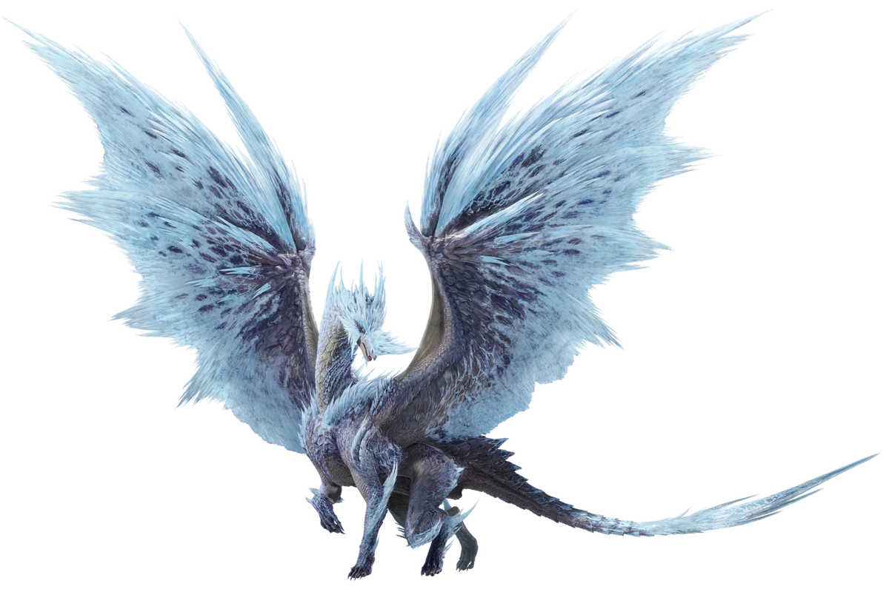

<link rel="stylesheet" href="../../base.css">

# Rango ✪✪✪✪✪✪ (6)

Estos monstruos representan la mayor amenaza, representaciones mismas de los desastres naturales, su sola presencia afecta al ecosistema.

## [Kushala Daora](Kushala%20Daora/Kushala%20Daora.html)

Un dragón anciano con escamas metálicas y la capacidad de controlar el viento a voluntad, genera barreras de viento para defenderse y poderosos tornados para controlar el campo de batalla.

## [Velkhana](Velkhana/Velkhana.html)

Un dragón anciano capaz de congelar todo a su paso con su aliento, utiliza el hielo como una armadura para defenderse y puede llenar el campo con una bruma helada que dificulta la movilidad.

## [Valstrax](Valstrax/Valstrax.html)

Un dragón anciano bastante raro de presenciar, utiliza un órgano especial en su pecho para producir energía Draco en cantidades increíbles, y expulsa esta energía por sus alas las cuales son tan afiladas como cuchillas. Esta capacidad de expulsar la energía draco le da la capacidad de volar a altísimas velocidades y cruzar largas distancias en cuestion de segundos.

