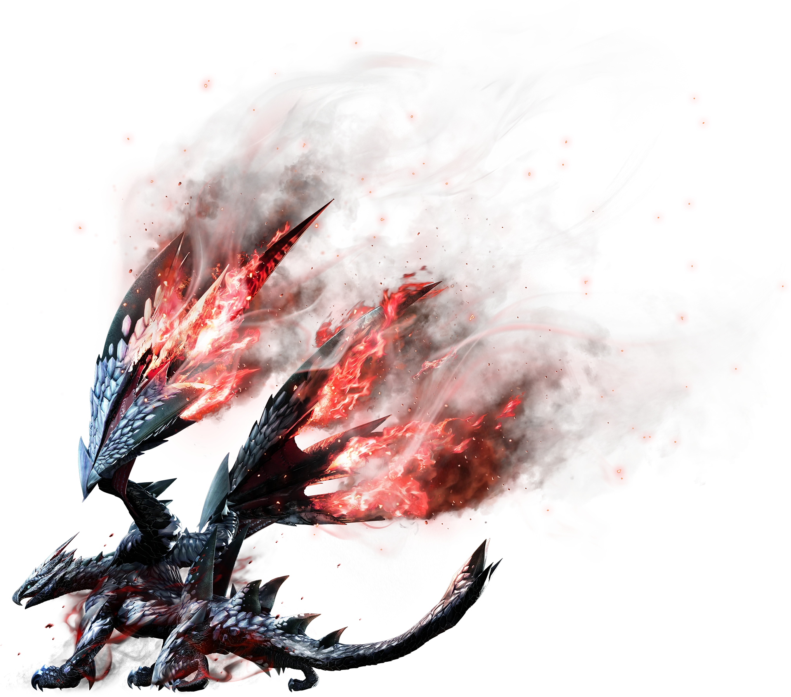

<link rel="stylesheet" href="../../../base.css">

# Valstrax

Un dragón anciano bastante raro de presenciar, utiliza un órgano especial en su pecho para producir energía Draco en cantidades increíbles, y expulsa esta energía por sus alas las cuales son tan afiladas como cuchillas. Esta capacidad de expulsar la energía draco le da la capacidad de volar a altísimas velocidades y cruzar largas distancias en cuestion de segundos.

## Fisiología

<table>
  <thead>
    <tr>
      <th>Elemento / Estado Alterado</th>
      <th>Nivel de Resistencia</th>
    </tr>
  </thead>
  <tbody>
    <tr>
      <td>Fuego</td>
      <td>-2 ✪</td>
    </tr>
    <tr>
      <td>Rayo</td>
      <td>-2 ✪</td>
    </tr>
    <tr>
      <td>Hielo</td>
      <td>-2 ✪</td>
    </tr>
    <tr>
      <td>Agua</td>
      <td>-2 ✪</td>
    </tr>
    <tr>
      <td>Draco</td>
      <td>Inmune</td>
    </tr>
    <tr>
      <td>Aturdimiento</td>
      <td>-2 ✪</td>
    </tr>
  </tbody>
</table>

### Partes Rompibles

<table>
  <thead>
    <tr>
      <th>Parte</th>
      <th>Cortante</th>
      <th>Contundente</th>
      <th>Perforante</th>
    </tr>
  </thead>
  <tbody>
    <tr>
      <td>Cabeza</td>
      <td>✪✪</td>
      <td>✪✪✪</td>
      <td>✪</td>
    </tr>
    <tr>
      <td>Patas delanteras</td>
      <td>✪</td>
      <td>✪</td>
      <td>✪</td>
    </tr>
    <tr>
      <td>Alas</td>
      <td>✪</td>
      <td>✪</td>
      <td>✪✪✪</td>
    </tr>
    <tr>
      <td>Cola</td>
      <td>✪✪</td>
      <td>✪</td>
      <td>✪</td>
    </tr>
  </tbody>
</table>

## Armas

Las Armas de Valstrax son de elemento Draco.

## Armadura

<table>
  <thead>
    <tr>
      <th>Elemento</th>
      <th>Nivel de Resistencia</th>
    </tr>
  </thead>
  <tbody>
    <tr>
      <td>Rayo</td>
      <td>-2 ✪</td>
    </tr>
    <tr>
      <td>Hielo</td>
      <td>-2 ✪</td>
    </tr>
    <tr>
      <td>Agua</td>
      <td>-2 ✪</td>
    </tr>
    <tr>
      <td>Fuego</td>
      <td>-2 ✪</td>
    </tr>
    <tr>
      <td>Draco</td>
      <td>+3 ✪</td>
    </tr>
  </tbody>
</table>

### Habilidades

<table>
  <tr>
    <td>Afilado</td>
    <td>Tus ataques se consideran críticos en Nat18-20.</td>
  </tr>
  <tr>
    <td>Corazón de Dragón</td>
    <td>Si tu vida baja a la mitad, tus resistencias elementales negativas se vuelven positivas y el daño Draco que realizas recibe un bonus de 2d4.</td>
  </tr>
</table>