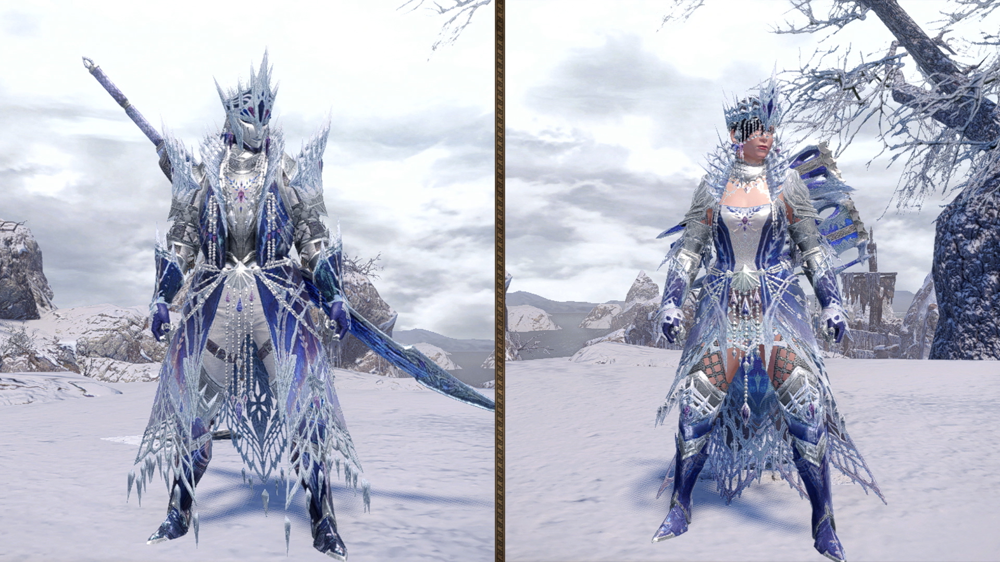

<link rel="stylesheet" href="../../../base.css">

# Velkhana

Un dragón anciano capaz de congelar todo a su paso con su aliento, utiliza el hielo como una armadura para defenderse y puede llenar el campo con una bruma helada que dificulta la movilidad.

## Fisiología

<table>
  <thead>
    <tr>
      <th>Elemento / Estado Alterado</th>
      <th>Nivel de Resistencia</th>
    </tr>
  </thead>
  <tbody>
    <tr>
      <td>Fuego</td>
      <td>-3 ✪</td>
    </tr>
    <tr>
      <td>Rayo</td>
      <td>-2 ✪</td>
    </tr>
    <tr>
      <td>Draco</td>
      <td>-2 ✪</td>
    </tr>
    <tr>
      <td>Hielo</td>
      <td>Inmune</td>
    </tr>
    <tr>
      <td>Aturdimiento</td>
      <td>-1 ✪</td>
    </tr>
  </tbody>
</table>

### Partes Rompibles

## Armas

Las Armas de Velkhana son de elemento Hielo.

## Armadura

<table>
  <thead>
    <tr>
      <th>Elemento</th>
      <th>Nivel de Resistencia</th>
    </tr>
  </thead>
  <tbody>
    <tr>
      <td>Fuego</td>
      <td>-3 ✪</td>
    </tr>
    <tr>
      <td>Rayo</td>
      <td>-1 ✪</td>
    </tr>
    <tr>
      <td>Hielo</td>
      <td>+3 ✪</td>
    </tr>
  </tbody>
</table>

### Habilidades

<table>
  <tr>
    <td>Agallas</td>
    <td>Si un golpe que recibiste fuera a reducir tu vida a 0 mientras tienes más de 1/4 de tu vida máxima, lanza 1 Hit Dice, el resultado es tu vida actual después del ataque.</td>
  </tr>
  <tr>
    <td>Aura Helada</td>
    <td>Al comenzar la batalla, tu primer ataque realiza 2d6 de daño extra, el segundo ataque realiza 1d6 y el tercero realiza 1d4. Este efecto se reinicia después de un descanso corto.</td>
  </tr>
</table>