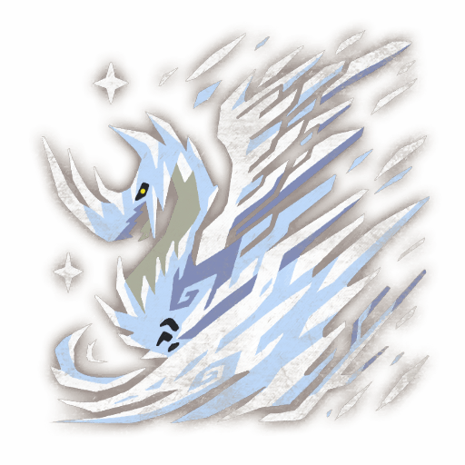
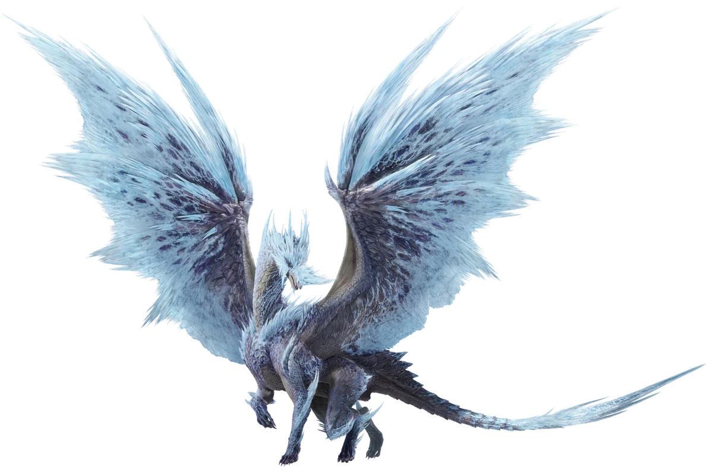
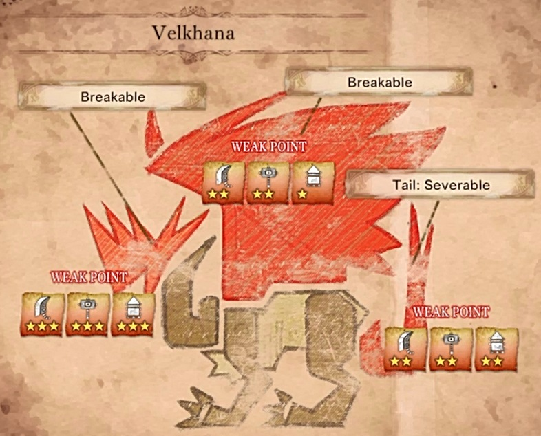

<link rel="stylesheet" href="../../../base.css">

# Velkhana

Un dragón anciano capaz de congelar todo a su paso con su aliento, utiliza el hielo como una armadura para defenderse y puede llenar el campo con una bruma helada que dificulta la movilidad.

## Fisiología

<table>
  <thead>
    <tr>
      <th>Elemento / Estado Alterado</th>
      <th>Nivel de Resistencia</th>
    </tr>
  </thead>
  <tbody>
    <tr>
      <td>Fuego</td>
      <td>-3 ✪</td>
    </tr>
    <tr>
      <td>Rayo</td>
      <td>-2 ✪</td>
    </tr>
    <tr>
      <td>Draco</td>
      <td>-2 ✪</td>
    </tr>
    <tr>
      <td>Hielo</td>
      <td>Inmune</td>
    </tr>
    <tr>
      <td>Aturdimiento</td>
      <td>-1 ✪</td>
    </tr>
  </tbody>
</table>

### Partes Rompibles

